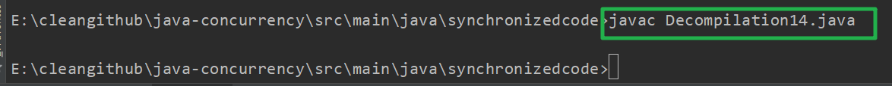

Java并发


----

# 并发编程的“基石”——多线程概念建立


## 1.多线程

```java
package background;

/**
 * 描述：     创建100个线程，用活动监视器的CPU栏目看Java线程数量的变化，10秒后线程消失了。
 */
public class Create100Threads {
    public static void main(String[] args) {
        for (int i = 0; i < 200; i++) {
            new Thread(new Runnable() {
                @Override
                public void run() {
                    try {
                        Thread.sleep(10000);
                    } catch (InterruptedException e) {
                        e.printStackTrace();
                    }
                }
            }).start();
        }
    }

}

```

```java
package background;

/**
 * 描述：     即使代码中不显示创建线程，在运行main时，JVM也会自动启动其他的线程，用断点debug查看
 */
public class JavaAndThreads {

    public static void main(String[] args) {
        System.out.println("Hello Threads!");
    }
}

```


-----------------------------

# Java高并发之魂：synchronized深度解析

# 第2章 Synchronized简介

## 2-3 不用并发手段的后果预警 

代码实战:两个线程同时a++,最后结果会比预计的少

```java
package synchronizedcode;


/**
 * 描述： 消失的请求数
 */
public class DisappearRequest1 implements Runnable{

    static DisappearRequest1 instance = new DisappearRequest1();

    static int i = 0;

    public static void main(String[] args) throws InterruptedException {
        Thread t1 = new Thread(instance);
        Thread t2 = new Thread(instance);

        t1.start();
        t2.start();

        // 让主线程等待子线程
        t1.join();
        t2.join();
        System.out.println(i);
    }

    @Override
    public void run() {
        for (int j = 0; j < 10000; j++) {
            i++;
        }
    }
}

```

---

# 第3章 Synchronized的两种用法（对象锁和类锁）

## 3-2 对象锁的形式1-同步代码块

```java
package synchronizedcode;

/**
 * 描述: 对象锁示例1，代码块形式
 */
public class SynchronizedObjectCodeBlock2 implements Runnable {

    static SynchronizedObjectCodeBlock2 instance = new SynchronizedObjectCodeBlock2();


    @Override
    public void run() {

        // 保证程序是串行的
        synchronized (this) {
            System.out.println("我是对象锁的代码块形式。我叫"
            + Thread.currentThread().getName());

            try {
                Thread.sleep(3000);
            } catch (InterruptedException e) {
                e.printStackTrace();
            }

            System.out.println(Thread.currentThread().getName()
            + "运行结束");
        }
    }

    public static void main(String[] args) {
        Thread t1 = new Thread(instance);
        Thread t2 = new Thread(instance);
        t1.start();
        t2.start();

        // t1和t2线程存在
        while (t1.isAlive() || t2.isAlive()) {

        }

        System.out.println("finished");
    }
}

```

---

```java
package synchronizedcode;

/**
 * 描述: 对象锁示例1，代码块形式
 */
public class SynchronizedObjectCodeBlock22 implements Runnable {

    static SynchronizedObjectCodeBlock22 instance = new SynchronizedObjectCodeBlock22();

    Object lock1 = new Object();
    Object lock2 = new Object();


    @Override
    public void run() {

        // 保证程序是串行的
        synchronized (lock1) {
            System.out.println("我是lock1。我叫"
            + Thread.currentThread().getName());

            try {
                Thread.sleep(3000);
            } catch (InterruptedException e) {
                e.printStackTrace();
            }

            System.out.println(Thread.currentThread().getName()
            + "lock1部分运行结束");
        }

        synchronized (lock2) {
            System.out.println("我是lock2。我叫"
                    + Thread.currentThread().getName());

            try {
                Thread.sleep(3000);
            } catch (InterruptedException e) {
                e.printStackTrace();
            }

            System.out.println(Thread.currentThread().getName()
                    + "lock2部分运行结束");
        }
    }

    public static void main(String[] args) {
        Thread t1 = new Thread(instance);
        Thread t2 = new Thread(instance);
        t1.start();
        t2.start();

        // t1和t2线程存在
        while (t1.isAlive() || t2.isAlive()) {

        }

        System.out.println("finished");
    }
}

```

## 3-4 对象锁的形式2-普通方法锁 

```java
package synchronizedcode;

/**
 * 描述: 对象锁示例2，方法锁形式
 */
public class SynchronizedObjectMethod3 implements Runnable {

    static SynchronizedObjectMethod3 instance = new SynchronizedObjectMethod3();


    @Override
    public void run() {

       method();
    }

    public synchronized void method() {
        System.out.println("我的对象锁的方法修饰符形式，我叫" +
                Thread.currentThread().getName());

        try {
            Thread.sleep(3000);
        } catch (InterruptedException e) {
            e.printStackTrace();
        }

        System.out.println(Thread.currentThread().getName() +
                "运行结束");
    }

    public static void main(String[] args) {
        Thread t1 = new Thread(instance);
        Thread t2 = new Thread(instance);
        t1.start();
        t2.start();

        // t1和t2线程存在
        while (t1.isAlive() || t2.isAlive()) {

        }

        System.out.println("finished");
    }
}

```

---

## 3-6 类锁的形式1-静态方法锁 

```java
package synchronizedcode;

/**
 * 描述: 类所的第一种形式，static形式
 */
public class SynchronizedClassStatic4 implements Runnable {

    static SynchronizedClassStatic4 instance1 = new SynchronizedClassStatic4();
    static SynchronizedClassStatic4 instance2 = new SynchronizedClassStatic4();


    @Override
    public void run() {
        method();
    }

    // 注意：这个方法被static修饰了
    // 不加static，线程就会并行执行
    public static synchronized void method() {
        System.out.println("我的类锁的第一种形式：static形式。我叫" +
                Thread.currentThread().getName());

        try {
            Thread.sleep(3000);
        } catch (InterruptedException e) {
            e.printStackTrace();
        }

        System.out.println(Thread.currentThread().getName() +
                "运行结束");
    }

    public static void main(String[] args) {
        Thread t1 = new Thread(instance1);
        Thread t2 = new Thread(instance2);
        t1.start();
        t2.start();

        // t1和t2线程存在
        while (t1.isAlive() || t2.isAlive()) {

        }

        System.out.println("finished");
    }
}

```

---

## 3-7 类锁的形式2--.class

```java
package synchronizedcode;

/**
 * 描述: 类锁的第二种形式，synchronized（*.class）
 */
public class SynchronizedClassClass5 implements Runnable {

    static SynchronizedClassClass5 instance1 = new SynchronizedClassClass5();
    static SynchronizedClassClass5 instance2 = new SynchronizedClassClass5();


    @Override
    public void run() {

       method();
    }

    public synchronized void method() {

        // 这里如果是this的话，线程就会并行执行
        synchronized (SynchronizedClassClass5.class) {
            System.out.println("类锁的第二种形式，synchronized（*.class），我叫" +
                    Thread.currentThread().getName());

            try {
                Thread.sleep(3000);
            } catch (InterruptedException e) {
                e.printStackTrace();
            }

            System.out.println(Thread.currentThread().getName() +
                    "运行结束");
        }
    }

    public static void main(String[] args) {
        Thread t1 = new Thread(instance1);
        Thread t2 = new Thread(instance2);
        t1.start();
        t2.start();

        // t1和t2线程存在
        while (t1.isAlive() || t2.isAlive()) {

        }

        System.out.println("finished");
    }
}

```

---

## 3-8 消失的请求解决方案

### 方法一

```java
package synchronizedcode;


/**
 * 描述： 消失的请求数
 */
public class DisappearRequest12 implements Runnable{

    static DisappearRequest12 instance = new DisappearRequest12();

    static int i = 0;

    public static void main(String[] args) throws InterruptedException {
        Thread t1 = new Thread(instance);
        Thread t2 = new Thread(instance);

        t1.start();
        t2.start();

        // 让主线程等待子线程
        t1.join();
        t2.join();
        System.out.println(i);
    }

    @Override
    public synchronized void run() {
        for (int j = 0; j < 10000; j++) {
            i++;
        }
    }
}

```


### 方法二

```java
package synchronizedcode;


/**
 * 描述： 消失的请求数
 */
public class DisappearRequest13 implements Runnable{

    static DisappearRequest13 instance = new DisappearRequest13();

    static int i = 0;

    public static void main(String[] args) throws InterruptedException {
        Thread t1 = new Thread(instance);
        Thread t2 = new Thread(instance);

        t1.start();
        t2.start();

        // 让主线程等待子线程
        t1.join();
        t2.join();
        System.out.println(i);
    }

    @Override
    public  void run() {
        synchronized (this) {
            for (int j = 0; j < 10000; j++) {
                i++;
            }
        }
    }
}

```


---

### 方法三

```java
package synchronizedcode;


/**
 * 描述： 消失的请求数
 */
public class DisappearRequest14 implements Runnable{

    static DisappearRequest14 instance = new DisappearRequest14();

    static int i = 0;

    public static void main(String[] args) throws InterruptedException {
        Thread t1 = new Thread(instance);
        Thread t2 = new Thread(instance);

        t1.start();
        t2.start();

        // 让主线程等待子线程
        t1.join();
        t2.join();
        System.out.println(i);
    }

    @Override
    public  void run() {
        synchronized (DisappearRequest14.class) {
            for (int j = 0; j < 10000; j++) {
                i++;
            }
        }
    }
}

```


---

# 第4章 多线程访问同步方法的7种具体情况


## 4.同步访问同步方法和非同步方法

```java
package synchronizedcode;

/**
 * 描述： 同步访问同步方法和非同步方法
 */
public class SynchronizedYesAndNo6 implements Runnable {

    static SynchronizedYesAndNo6 instance1 = new SynchronizedYesAndNo6();
    static SynchronizedYesAndNo6 instance2 = new SynchronizedYesAndNo6();

    @Override
    public void run() {

        if (Thread.currentThread().getName().equals("Thread-0")) {
            method1();
        } else {
            method2();
        }
    }

    public synchronized void method1() {
        System.out.println("我是加锁的方法，我叫" +
                Thread.currentThread().getName());

        try {
            Thread.sleep(3000);
        } catch (InterruptedException e) {
            e.printStackTrace();
        }

        System.out.println(Thread.currentThread().getName() +
                "运行结束");
    }

    public void method2() {
        System.out.println("我是没加锁的方法，我叫" +
                Thread.currentThread().getName());

        try {
            Thread.sleep(3000);
        } catch (InterruptedException e) {
            e.printStackTrace();
        }

        System.out.println(Thread.currentThread().getName() +
                "运行结束");
    }

    public static void main(String[] args) {
        Thread t1 = new Thread(instance1);
        Thread t2 = new Thread(instance2);
        t1.start();
        t2.start();

        // t1和t2线程存在
        while (t1.isAlive() || t2.isAlive()) {

        }

        System.out.println("finished");
    }
}


```

## 5.访问同一个对象的不同的普通同步方法

```java
package synchronizedcode;

/**
 * 描述： 访问同一个类的不同的普通同步方法
 */
public class SynchronizedDifferentMethod7 implements Runnable {

    static SynchronizedDifferentMethod7 instance = new SynchronizedDifferentMethod7();

    @Override
    public void run() {

        if (Thread.currentThread().getName().equals("Thread-0")) {
            method1();
        } else {
            method2();
        }
    }

    public synchronized void method1() {
        System.out.println("我是加锁的方法，我叫" +
                Thread.currentThread().getName());

        try {
            Thread.sleep(3000);
        } catch (InterruptedException e) {
            e.printStackTrace();
        }

        System.out.println(Thread.currentThread().getName() +
                "运行结束");
    }

    public synchronized void method2() {
        System.out.println("我是加锁的方法，我叫" +
                Thread.currentThread().getName());

        try {
            Thread.sleep(3000);
        } catch (InterruptedException e) {
            e.printStackTrace();
        }

        System.out.println(Thread.currentThread().getName() +
                "运行结束");
    }

    public static void main(String[] args) {
        Thread t1 = new Thread(instance);
        Thread t2 = new Thread(instance);
        t1.start();
        t2.start();

        // t1和t2线程存在
        while (t1.isAlive() || t2.isAlive()) {

        }

        System.out.println("finished");
    }
}


```

---

## 6.同时访问静态synchronized和非静态synchronized方法

```java
package synchronizedcode;

/**
 * 描述： 同时访问静态synchronized和非静态synchronized方法
 */
public class SynchronizedStaticAndNormal8 implements Runnable {

    static SynchronizedStaticAndNormal8 instance = new SynchronizedStaticAndNormal8();

    @Override
    public void run() {

        if (Thread.currentThread().getName().equals("Thread-0")) {
            method1();
        } else {
            method2();
        }
    }

    // 方法一的锁对象是class
    // 方法二的锁对象是this
    // 两者的锁对象不同，所以可以并发执行
    public synchronized static void method1() {
        System.out.println("我是静态加锁的方法1，我叫" +
                Thread.currentThread().getName());

        try {
            Thread.sleep(3000);
        } catch (InterruptedException e) {
            e.printStackTrace();
        }

        System.out.println(Thread.currentThread().getName() +
                "运行结束");
    }

    public synchronized void method2() {
        System.out.println("我是非静态加锁的方法2，我叫" +
                Thread.currentThread().getName());

        try {
            Thread.sleep(3000);
        } catch (InterruptedException e) {
            e.printStackTrace();
        }

        System.out.println(Thread.currentThread().getName() +
                "运行结束");
    }

    public static void main(String[] args) {
        Thread t1 = new Thread(instance);
        Thread t2 = new Thread(instance);
        t1.start();
        t2.start();

        // t1和t2线程存在
        while (t1.isAlive() || t2.isAlive()) {

        }

        System.out.println("finished");
    }
}


```

---

## 7.方法抛异常后，会释放锁

```java
package synchronizedcode;

/**
 * 描述： 方法抛异常后，会释放锁。展示不抛出异常前和抛出异常后的对比：
 * 一旦抛出异常，第二个线程会立刻进入同步方法，意味者锁已经释放
 */
public class SynchronizedException9 implements Runnable {

    static SynchronizedException9 instance = new SynchronizedException9();

    @Override
    public void run() {

        if (Thread.currentThread().getName().equals("Thread-0")) {
            method1();
        } else {
            method2();
        }
    }

    public synchronized  void method1() {
        System.out.println("我是非静态加锁的方法1，我叫" +
                Thread.currentThread().getName());

        try {
            Thread.sleep(3000);
            throw new Exception();
        } catch (InterruptedException e) {
            e.printStackTrace();
        } catch (Exception e) {
            e.printStackTrace();
        }

        System.out.println(Thread.currentThread().getName() +
                "运行结束");
    }

    public synchronized void method2() {
        System.out.println("我是非静态加锁的方法2，我叫" +
                Thread.currentThread().getName());

        try {
            Thread.sleep(3000);
        } catch (InterruptedException e) {
            e.printStackTrace();
        }

        System.out.println(Thread.currentThread().getName() +
                "运行结束");
    }

    public static void main(String[] args) {
        Thread t1 = new Thread(instance);
        Thread t2 = new Thread(instance);
        t1.start();
        t2.start();

        // t1和t2线程存在
        while (t1.isAlive() || t2.isAlive()) {

        }

        System.out.println("finished");
    }
}


```

---

```java
package synchronizedcode;

/**
 * 描述： 方法抛异常后，会释放锁。展示不抛出异常前和抛出异常后的对比：
 * 一旦抛出异常，第二个线程会立刻进入同步方法，意味者锁已经释放
 */
public class SynchronizedException92 implements Runnable {

    static SynchronizedException92 instance = new SynchronizedException92();

    @Override
    public void run() {

        if (Thread.currentThread().getName().equals("Thread-0")) {
            method1();
        } else {
            method2();
        }
    }


    public synchronized  void method1() {
        System.out.println("我是非静态加锁的方法1，我叫" +
                Thread.currentThread().getName());

        try {
            Thread.sleep(3000);
        } catch (InterruptedException e) {
            e.printStackTrace();
        }

        throw new RuntimeException();

//        System.out.println(Thread.currentThread().getName() +
//                "运行结束");
    }

    public synchronized void method2() {
        System.out.println("我是非静态加锁的方法2，我叫" +
                Thread.currentThread().getName());

        try {
            Thread.sleep(3000);
        } catch (InterruptedException e) {
            e.printStackTrace();
        }

        System.out.println(Thread.currentThread().getName() +
                "运行结束");
    }

    public static void main(String[] args) {
        Thread t1 = new Thread(instance);
        Thread t2 = new Thread(instance);
        t1.start();
        t2.start();

        // t1和t2线程存在
        while (t1.isAlive() || t2.isAlive()) {

        }

        System.out.println("finished");
    }
}


```

---

# 第5章 Synchronized的性质

## 一、可重入性质

### 1.可重入粒度测试:递归调用本方法

```java
package synchronizedcode;

/**
 * 描述： 可重入粒度测试:递归调用本方法
 */
public class SynchronizedRecursion10 {

    int a = 0;

    public static void main(String[] args) {
        SynchronizedRecursion10 synchronizedRecursion10 = new SynchronizedRecursion10();
        synchronizedRecursion10.method1();
    }

    private synchronized void method1() {
        System.out.println("这是method1，a=" + a);
        if (a == 0) {
            a++;
            method1();
        }
    }
}

```

### 2.可重入粒度测试:调用类内另外的方法

```java
package synchronizedcode;

/**
 * 描述： 可重入粒度测试:调用类内另外的方法
 */
public class SynchronizedOtherMethod11 {

    public static void main(String[] args) {
        SynchronizedOtherMethod11 synchronizedRecursion10 = new SynchronizedOtherMethod11();
        synchronizedRecursion10.method1();
    }

    private synchronized void method1() {
        System.out.println("这是method1");
        method2();

    }

    private synchronized void method2() {
        System.out.println("这是method2");
    }
}

```

---

### 3.可重入粒度测试,调用父类的方法

```java
package synchronizedcode;

/**
 * 描述： 可重入粒度测试,调用父类的方法
 */
public class SynchronizedSuperClass12 {

    public synchronized void doSomething() {
        System.out.println("我是父类方法");
    }


}

class TestClass extends SynchronizedSuperClass12 {
    public synchronized void doSomething() {
        System.out.println("我是子类方法");

        // 调用父类方法
        super.doSomething();
    }

    public static void main(String[] args) {
        TestClass s = new TestClass();
        s.doSomething();
    }
}

```

---

## 二、不可中断性质

一旦这个锁已经被别人获得了,如果我还想获得,我只能选择等待或者阻塞,直到别的线程释放这个锁。如果别人永远不释放锁那么我只能永远地等下去。

---

# 第6章 深入原理


## 一、 加锁和释放锁的原理

等价代码

```java
package synchronizedcode;

import java.util.concurrent.locks.Lock;
import java.util.concurrent.locks.ReentrantLock;

public class SynchronizedToLock13 {

    Lock lock = new ReentrantLock();


    // 下面两个方法是等价的
    public synchronized void method1() {
        System.out.println("我是Synchronized形式的锁");
    }

    public void method2() {
        lock.lock();

        try {
            System.out.println("我是lock形式的锁");
        } finally {

            lock.unlock();
        }
    }


    public static void main(String[] args) {
        SynchronizedToLock13 s = new SynchronizedToLock13();
        s.method1();
        s.method2();
    }
}

```

---

## 二、反编译看monitor指令 

```java
package synchronizedcode;

/**
 * 描述： 反编译字节码
 */

public class Decompilation14 {

    private Object object = new Object();

    public void insert(Thread thread) {
        synchronized (object) {

        }
    }
}

```



```
javac Decompilation14.java
```


```
javap -verbose Decompilation14.class
```


---

# 第7章 Synchronized的缺陷

```java
package synchronizedcode;

import java.util.concurrent.TimeUnit;
import java.util.concurrent.locks.Lock;
import java.util.concurrent.locks.ReentrantLock;

/**
 * 描述：展示Lock的方法
 */
public class LockExample15 {

    public static void main(String[] args) {
        Lock lock = new ReentrantLock();

        lock.lock();
        lock.unlock();
        lock.tryLock();
//        lock.tryLock(10, TimeUnit.SECONDS)
    }
}

```

```
效率低
  锁的释放情况少
  试图获得锁时不能设定超时
  不能中断一个正在试图获得锁的线程
不够灵活（读写锁更灵活）
  加锁和释放的时机单一
  每个锁仅有单一的条件（某个对象），可能是不够的
无法知道是否成功获取到锁
```

----

# 


---

# Java并发核心知识体系精讲


# 第一章 线程8大核心基础

## 一、实现多线程

### 正确做法

两种

#### 1.实现Runnable接口

```java
package threadcoreknowledge.createthreads;

/**
 * 描述：     用Runnable方式创建线程
 */
public class RunnableStyle implements Runnable{

    public static void main(String[] args) {
        Thread thread = new Thread(new RunnableStyle());
        thread.start();
    }

    @Override
    public void run() {
        System.out.println("用Runnable方法实现线程");
    }
}

```

#### 2.继承Thread类

```java
package threadcoreknowledge.createthreads;

/**
 * 描述：     用Thread方式实现线程
 */
public class ThreadStyle extends Thread{

    @Override
    public void run() {
        System.out.println("用Thread类实现线程");
    }

    public static void main(String[] args) {
        new ThreadStyle().start();
    }
}


```

#### 3.同时使用

```java
package threadcoreknowledge.createthreads;

/**
 * 描述：     同时使用Runnable和Thread两种实现线程的方式
 */
public class BothRunnableThread {

    public static void main(String[] args) {
        new Thread(new Runnable() {
            @Override
            public void run() {
                System.out.println("我来自Runnable");
            }
        }) {
            @Override
            public void run() {
                System.out.println("我来自Thread");
            }
        }.start();
    }
}

```

### 错误方式

#### 1.线程池

```java
package threadcoreknowledge.createthreads.wrongways;

import java.util.concurrent.ExecutorService;
import java.util.concurrent.Executors;

/**
 * 描述：     线程池创建线程的方法
 */
public class ThreadPool5 {

    public static void main(String[] args) {
        ExecutorService executorService = Executors.newCachedThreadPool();
        for (int i = 0; i < 1000; i++) {
            executorService.submit(new Task() {
            });
        }
    }
}

class Task implements Runnable {

    @Override
    public void run() {
        try {
            //休眠
            Thread.sleep(500);
        } catch (InterruptedException e) {
            e.printStackTrace();
        }
        //打印出当前线程的名字
        System.out.println(Thread.currentThread().getName());
    }
}

```

#### 2.定时器

```java
package threadcoreknowledge.createthreads.wrongways;

import java.util.Timer;
import java.util.TimerTask;

/**
 * 描述：     定时器创建线程
 */
public class DemoTimmerTask {

    public static void main(String[] args) {
        Timer timer = new Timer();
        timer.scheduleAtFixedRate(new TimerTask() {
            @Override
            public void run() {
                System.out.println(Thread.currentThread().getName());
            }
        }, 1000, 1000);
    }
}

```

#### 3.匿名内部类

```java
package threadcoreknowledge.createthreads.wrongways;

import threadcoreknowledge.createthreads.ThreadStyle;

/**
 * 描述：     匿名内部类的方式
 */
public class AnonymousInnerClassDemo {

    public static void main(String[] args) {
        new Thread(){
            @Override
            public void run() {
                System.out.println(Thread.currentThread().getName());
            }
        }.start();
        new Thread(new Runnable() {
            @Override
            public void run() {
                System.out.println(Thread.currentThread().getName());
            }
        }).start();
    }
}

```

#### 4.lambda

实际上是实现runnable

```java
package threadcoreknowledge.createthreads.wrongways;

/**
 * 描述：     lambda表达式创建线程
 */
public class Lambda {

    public static void main(String[] args) {
        new Thread(() -> System.out.println(Thread.currentThread().getName())).start();
    }
}

```

## 二、启动线程的正确和错误方法

### 对比start和run两种启动线程的方式

```java
package threadcoreknowledge.startthread;

import threadcoreknowledge.createthreads.ThreadStyle;

/**
 * 描述：     对比start和run两种启动线程的方式
 */
public class StartAndRunMethod {

    public static void main(String[] args) {
        Runnable runnable = () -> {
            System.out.println(Thread.currentThread().getName());

        };
        runnable.run();

        new Thread(runnable).start();
    }
}

```

## 三、如何正确停止线程

### 1.停止线程

#### a.普通情况下停止线程

```java
package threadcoreknowledge.stopthreads;

/**
 * 描述：     run方法内没有sleep或wait方法时，停止线程
 */
public class RightWayStopThreadWithoutSleep implements Runnable {

    @Override
    public void run() {
        int num = 0;
        //有这个!Thread.currentThread().isInterrupted()。线程才能配合interrupt()停止
        while (!Thread.currentThread().isInterrupted() && num <= Integer.MAX_VALUE / 2) {
            if (num % 10000 == 0) {
                System.out.println(num + "是10000的倍数");
            }
            num++;
        }
        System.out.println("任务运行结束了");
    }

    public static void main(String[] args) throws InterruptedException {
        Thread thread = new Thread(new RightWayStopThreadWithoutSleep());
        thread.start();
        Thread.sleep(2000);
        thread.interrupt();
    }
}

```

#### b.线程可能被阻塞

使用try catch去处理

```java
package threadcoreknowledge.stopthreads;

/**
 * 描述：     run方法内没有sleep或wait方法时，停止线程
 */
public class RightWayStopThreadWithoutSleep implements Runnable {

    @Override
    public void run() {
        int num = 0;
        //有这个!Thread.currentThread().isInterrupted()。线程才能配合interrupt()停止
        while (!Thread.currentThread().isInterrupted() && num <= Integer.MAX_VALUE / 2) {
            if (num % 10000 == 0) {
                System.out.println(num + "是10000的倍数");
            }
            num++;
        }
        System.out.println("任务运行结束了");
    }

    public static void main(String[] args) throws InterruptedException {
        Thread thread = new Thread(new RightWayStopThreadWithoutSleep());
        thread.start();
        Thread.sleep(2000);
        thread.interrupt();
    }
}

```

#### c.线程在每次工作迭代之后都阻塞

不需要 `Thread.currentThread().isInterrupted()` 这样的判断

```java
package threadcoreknowledge.stopthreads;

/**
 * 描述：     如果在执行过程中，每次循环都会调用sleep或wait等方法，那么不需要每次迭代都检查是否已中断
 */
public class RightWayStopThreadWithSleepEveryLoop {
    public static void main(String[] args) throws InterruptedException {
        Runnable runnable = () -> {
            int num = 0;
            try {
                //这里不需要`Thread.currentThread().isInterrupted()` 这样的判断
                //因为迭代很快，所有大部分时间都在睡眠，所有没必要使用Thread.currentThread().isInterrupted()` 这样的判断
                while (num <= 10000) {
                    if (num % 100 == 0) {
                        System.out.println(num + "是100的倍数");
                    }
                    num++;
                    Thread.sleep(10);
                }
            } catch (InterruptedException e) {
                e.printStackTrace();
            }
        };
        Thread thread = new Thread(runnable);
        thread.start();
        Thread.sleep(5000);
        thread.interrupt();
    }
}

```

#### d.在while内tyr/catch会遇到的问题

线程无法停止

原因：sleep函数响应中断后，会把Interrupted()标记位清除

```java
package threadcoreknowledge.stopthreads;

/**
 * 描述：     如果while里面放try/catch，会导致中断失效
 */
public class CantInterrupt {

    public static void main(String[] args) throws InterruptedException {
        Runnable runnable = () -> {
            int num = 0;
            //!Thread.currentThread().isInterrupted()加与不加，都无法停止线程
            while (num <= 10000 && !Thread.currentThread().isInterrupted()) {
                if (num % 100 == 0) {
                    System.out.println(num + "是100的倍数");
                }
                num++;
                try {
                    Thread.sleep(10);
                } catch (InterruptedException e) {
                    e.printStackTrace();
                }
            }
        };
        Thread thread = new Thread(runnable);
        thread.start();
        Thread.sleep(5000);
        thread.interrupt();
    }
}

```

---

### 2.两种最佳处理方式

#### a.优先选择：传递中断

```java
package threadcoreknowledge.stopthreads;

import threadcoreknowledge.createthreads.ThreadStyle;

/**
 * 描述：     最佳实践：catch了InterruptedExcetion之后的优先选择：在方法签名中抛出异常 那么在run()就会强制try/catch
 */
public class RightWayStopThreadInProd implements Runnable {

    @Override
    public void run() {
        while (true && !Thread.currentThread().isInterrupted()) {
            System.out.println("go");
            //run方法已经是顶层函数了，这里只能用try catch处理，普通方法是可以的，run方法是不能抛的
            try {
                throwInMethod();
            } catch (InterruptedException e) {
                Thread.currentThread().interrupt();
                //保存日志、停止程序
                System.out.println("保存日志");
                e.printStackTrace();
            }
        }
    }

    //不要用try catch ，使用的话，异常会被吞掉
    // 而是直接throw抛出异常。向上面抛
    private void throwInMethod() throws InterruptedException {
            Thread.sleep(2000);
    }

    public static void main(String[] args) throws InterruptedException {
        Thread thread = new Thread(new RightWayStopThreadInProd());
        thread.start();
        Thread.sleep(1000);
        thread.interrupt();
    }
}

```


```java
package threadcoreknowledge.stopthreads;

/**
 * 描述：     run无法抛出checked Exception，只能用try/catch
 */
public class RunThrowException {

    public void aVoid() throws Exception {
        throw new Exception();
    }

    public static void main(String[] args) {
        new Thread(new Runnable() {
            @Override
            public void run()  {
                try {
                    throw new Exception();
                } catch (Exception e) {
                    e.printStackTrace();
                }
            }
        });
    }
}

```

#### b.不想或无法传递：恢复中断

```java
package threadcoreknowledge.stopthreads;

/**
 * 描述：最佳实践2：在catch子语句中调用Thread.currentThread().interrupt()来恢复设置中断状态，以便于在后续的执行中，依然能够检查到刚才发生了中断
 * 回到刚才RightWayStopThreadInProd补上中断，让它跳出
 */
public class RightWayStopThreadInProd2 implements Runnable {

    @Override
    public void run() {
        while (true) {
            if (Thread.currentThread().isInterrupted()) {
                System.out.println("Interrupted，程序运行结束");
                break;
            }
            reInterrupt();
        }
    }

    private void reInterrupt() {
        try {
            Thread.sleep(2000);
        } catch (InterruptedException e) {
//            重新设置中断
            Thread.currentThread().interrupt();
            e.printStackTrace();
        }
    }

    public static void main(String[] args) throws InterruptedException {
        Thread thread = new Thread(new RightWayStopThreadInProd2());
        thread.start();
        Thread.sleep(1000);
        thread.interrupt();
    }
}

```

### 3.错误的方式

#### a.被弃用的stop、suspend和resume方法

```java
package threadcoreknowledge.stopthreads;

/**
 * 描述：     错误的停止方法：用stop()来停止线程，会导致线程运行一半突然停止，没办法完成一个基本单位的操作（一个连队），会造成脏数据（有的连队多领取少领取装备）。
 */
public class StopThread implements Runnable {

    @Override
    public void run() {
        //模拟指挥军队：一共有5个连队，每个连队10人，以连队为单位，发放武器弹药，叫到号的士兵前去领取
        for (int i = 0; i < 5; i++) {
            System.out.println("连队" + i + "开始领取武器");
            for (int j = 0; j < 10; j++) {
                System.out.println(j);
                try {
                    Thread.sleep(50);
                } catch (InterruptedException e) {
                    e.printStackTrace();
                }
            }
            System.out.println("连队"+i+"已经领取完毕");
        }
    }

    public static void main(String[] args) {
        Thread thread = new Thread(new StopThread());
        thread.start();
        try {
            Thread.sleep(1000);
        } catch (InterruptedException e) {
            e.printStackTrace();
        }
        thread.stop();
    }
}

```

#### b.用volatile设置boolean标记位

看上去可行

```java
package threadcoreknowledge.stopthreads.volatiledemo;

/**
 * 描述：     演示用volatile的局限：part1 看似可行
 */
public class WrongWayVolatile implements Runnable {

    //volatile 使具有可见性
    private volatile boolean canceled = false;

    @Override
    public void run() {
        int num = 0;
        try {
            while (num <= 100000 && !canceled) {
                if (num % 100 == 0) {
                    System.out.println(num + "是100的倍数。");
                }
                num++;
                Thread.sleep(1);
            }
        } catch (InterruptedException e) {
            e.printStackTrace();
        }
    }

    public static void main(String[] args) throws InterruptedException {
        WrongWayVolatile r = new WrongWayVolatile();
        Thread thread = new Thread(r);
        thread.start();
        //主程序等待5秒
        Thread.sleep(5000);
        r.canceled = true;
    }
}


```

错误之处

```java
package threadcoreknowledge.stopthreads.volatiledemo;

import java.util.concurrent.ArrayBlockingQueue;
import java.util.concurrent.BlockingQueue;
import java.util.concurrent.ConcurrentLinkedQueue;

/**
 * 描述：     演示用volatile的局限part2 陷入阻塞时，volatile是无法线程的 此例中，生产者的生产速度很快，消费者消费速度慢，所以阻塞队列满了以后，生产者会阻塞，等待消费者进一步消费
 */
public class WrongWayVolatileCantStop {

    public static void main(String[] args) throws InterruptedException {
        //实例化仓库
        ArrayBlockingQueue storage = new ArrayBlockingQueue(10);

        Producer producer = new Producer(storage);
        Thread producerThread = new Thread(producer);
        producerThread.start();
        //给定时间，让队列塞满
        Thread.sleep(1000);

        Consumer consumer = new Consumer(storage);
        while (consumer.needMoreNums()) {
            System.out.println(consumer.storage.take()+"被消费了");
            Thread.sleep(100);
        }
        System.out.println("消费者不需要更多数据了。");

        //一旦消费不需要更多数据了，我们应该让生产者也停下来，但是实际情况不会停止
        producer.canceled=true;
        System.out.println(producer.canceled);
    }
}

class Producer implements Runnable {

    public volatile boolean canceled = false;

    //阻塞队列
    BlockingQueue storage;

    public Producer(BlockingQueue storage) {
        this.storage = storage;
    }


    @Override
    public void run() {
        int num = 0;
        try {
            while (num <= 100000 && !canceled) {
                if (num % 100 == 0) {
                    //放入仓库
                    //线程不会停止，是因为阻塞在这里
                    storage.put(num);
                    System.out.println(num + "是100的倍数,被放到仓库中了。");
                }
                num++;
            }
        } catch (InterruptedException e) {
            e.printStackTrace();
        } finally {
            System.out.println("生产者结束运行");
        }
    }
}

class Consumer {

    BlockingQueue storage;

    public Consumer(BlockingQueue storage) {
        this.storage = storage;
    }

    //判断是否需要进一步消费
    public boolean needMoreNums() {
        if (Math.random() > 0.95) {
            return false;
        }
        return true;
    }
}
```


修正方案

```java
package threadcoreknowledge.stopthreads.volatiledemo;

import java.util.concurrent.ArrayBlockingQueue;
import java.util.concurrent.BlockingQueue;

/**
 * 描述：     用中断来修复刚才的无尽等待问题
 */
public class WrongWayVolatileFixed {

    public static void main(String[] args) throws InterruptedException {
        WrongWayVolatileFixed body = new WrongWayVolatileFixed();
        ArrayBlockingQueue storage = new ArrayBlockingQueue(10);

        //内部类的实例化
        Producer producer = body.new Producer(storage);
        Thread producerThread = new Thread(producer);
        producerThread.start();
        Thread.sleep(1000);

        Consumer consumer = body.new Consumer(storage);
        while (consumer.needMoreNums()) {
            System.out.println(consumer.storage.take() + "被消费了");
            Thread.sleep(100);
        }
        System.out.println("消费者不需要更多数据了。");

        //调用interrupt
        producerThread.interrupt();
    }


    //内部类
    class Producer implements Runnable {

        BlockingQueue storage;

        public Producer(BlockingQueue storage) {
            this.storage = storage;
        }


        @Override
        public void run() {
            int num = 0;
            try {
                while (num <= 100000 && !Thread.currentThread().isInterrupted()) {
                    if (num % 100 == 0) {
                        storage.put(num);
                        System.out.println(num + "是100的倍数,被放到仓库中了。");
                    }
                    num++;
                }
            } catch (InterruptedException e) {
                e.printStackTrace();
            } finally {
                System.out.println("生产者结束运行");
            }
        }
    }

    //内部类
    class Consumer {

        BlockingQueue storage;

        public Consumer(BlockingQueue storage) {
            this.storage = storage;
        }

        public boolean needMoreNums() {
            if (Math.random() > 0.95) {
                return false;
            }
            return true;
        }
    }
}

```

---

Thread.interrupted()

```java
package threadcoreknowledge.stopthreads;

/**
 * 描述：     注意Thread.interrupted()方法的目标对象是“当前线程”，而不管本方法来自于哪个对象
 */
public class RightWayInterrupted {

    public static void main(String[] args) throws InterruptedException {

        Thread threadOne = new Thread(new Runnable() {
            @Override
            public void run() {
                for (; ; ) {
                }
            }
        });

        // 启动线程
        threadOne.start();
        //设置中断标志
        threadOne.interrupt();
        //获取中断标志
        System.out.println("isInterrupted: " + threadOne.isInterrupted());
        //获取中断标志并重置
        //静态方法
        //执行的是main函数
        System.out.println("isInterrupted: " + threadOne.interrupted());
        //获取中断标志并重直
        //Thread.interrupted()是运行在main函数中的
        System.out.println("isInterrupted: " + Thread.interrupted());
        //获取中断标志
        System.out.println("isInterrupted: " + threadOne.isInterrupted());
        threadOne.join();
        System.out.println("Main thread is over.");
    }
}

```

---

## 四、线程的生命周期


### 1.线程的6个状态

```java
package threadcoreknowledge.sixstates;

/**
 * 描述：     展示线程的NEW、RUNNABLE、Terminated状态。即使是正在运行，也是Runnable状态，而不是Running。
 */
public class NewRunnableTerminated implements Runnable {

    public static void main(String[] args) {
        Thread thread = new Thread(new NewRunnableTerminated());
        //打印出NEW的状态
        System.out.println(thread.getState());
        thread.start();
        System.out.println(thread.getState());
        try {
            Thread.sleep(10);
        } catch (InterruptedException e) {
            e.printStackTrace();
        }
        //打印出RUNNABLE的状态，即使是正在运行，也是RUNNABLE，而不是RUNNING
        System.out.println(thread.getState());
        try {
            Thread.sleep(100);
        } catch (InterruptedException e) {
            e.printStackTrace();
        }
        //打印出TERMINATED状态
        System.out.println(thread.getState());
    }

    @Override
    public void run() {
        for (int i = 0; i < 1000; i++) {
            System.out.println(i);
        }
    }
}

```

---

```java
package threadcoreknowledge.sixstates;

/**
 * 描述：     展示Blocked, Waiting, TimedWaiting
 */
public class BlockedWaitingTimedWaiting implements Runnable{
    public static void main(String[] args) {
        BlockedWaitingTimedWaiting runnable = new BlockedWaitingTimedWaiting();
        Thread thread1 = new Thread(runnable);
        thread1.start();
        Thread thread2 = new Thread(runnable);
        thread2.start();
        try {
            Thread.sleep(5);
        } catch (InterruptedException e) {
            e.printStackTrace();
        }
        //打印出Timed_Waiting状态，因为正在执行Thread.sleep(1000);
        System.out.println(thread1.getState());
        //打印出BLOCKED状态，因为thread2想拿得到sync()的锁却拿不到
        System.out.println(thread2.getState());
        try {
            Thread.sleep(1300);
        } catch (InterruptedException e) {
            e.printStackTrace();
        }
        //打印出WAITING状态，因为执行了wait()
        System.out.println(thread1.getState());

    }

    @Override
    public void run() {
        syn();
    }

    private synchronized void syn() {
        try {
            Thread.sleep(1000);
            wait();
        } catch (InterruptedException e) {
            e.printStackTrace();
        }
    }
}

```

---

## 五、Thread和Object类中和和线程相关的重要方法


---


### 1.wait和notify的基本用法

```java
package threadcoreknowledge.threadobjectclasscommonmethods;

/**
 * 描述：     展示wait和notify的基本用法 1. 研究代码执行顺序 2. 证明wait释放锁
 */
public class Wait {

    public static Object object = new Object();

    static class Thread1 extends Thread {

        @Override
        public void run() {
            //synchronized性质：同时最多有一个线程运行
            synchronized (object) {
                System.out.println(Thread.currentThread().getName() + "开始执行了");
                try {
                    // 释放锁
                    object.wait();
                } catch (InterruptedException e) {
                    e.printStackTrace();
                }
                // 线程重新拿到了锁
                System.out.println("线程" + Thread.currentThread().getName() + "获取到了锁。");
            }
        }
    }

    //线程2用来唤醒线程1
    static class Thread2 extends Thread {

        @Override
        public void run() {
            synchronized (object) {
                //唤醒线程1，但不会立马释放锁，
                // 直到执行完程序，即走出synchronized同步代码块，才释放掉锁
                object.notify();
                System.out.println("线程" + Thread.currentThread().getName() + "调用了notify()");
            }
        }
    }

    public static void main(String[] args) throws InterruptedException {
        Thread1 thread1 = new Thread1();
        Thread2 thread2 = new Thread2();
        thread1.start();
        Thread.sleep(200);
        thread2.start();
    }
}

```

---

### 2.notify, notifyAll

```java
package threadcoreknowledge.threadobjectclasscommonmethods;

/**
 * 描述：     3个线程，线程1和线程2首先被阻塞，线程3唤醒它们。notify, notifyAll。 start先执行不代表线程先启动。
 */
public class WaitNotifyAll implements Runnable {

    private static final Object resourceA = new Object();


    public static void main(String[] args) throws InterruptedException {
        Runnable r = new WaitNotifyAll();
        Thread threadA = new Thread(r);
        Thread threadB = new Thread(r);
        Thread threadC = new Thread(new Runnable() {
            @Override
            public void run() {
                //synchronized 同步工作
                synchronized (resourceA) {
                    resourceA.notifyAll();
//                    resourceA.notify();
                    System.out.println("ThreadC notified.");
                }
            }
        });
        threadA.start();
        threadB.start();
        Thread.sleep(200);
        threadC.start();
    }
    @Override
    public void run() {
        synchronized (resourceA) {
            System.out.println(Thread.currentThread().getName()+" got resourceA lock.");
            try {
                System.out.println(Thread.currentThread().getName()+" waits to start.");
                resourceA.wait();
                System.out.println(Thread.currentThread().getName()+"'s waiting to end.");
            } catch (InterruptedException e) {
                e.printStackTrace();
            }
        }
    }
}

```

---

### 3.只释放当前monitor

```java
package threadcoreknowledge.threadobjectclasscommonmethods;

/**
 * 描述：     证明wait只释放当前的那把锁，对象持有锁
 */
public class WaitNotifyReleaseOwnMonitor {

    //  volatile
    //　一旦一个共享变量（类的成员变量、类的静态成员变量）被volatile修饰之后，那么就具备了两层语义：
    //　　1）保证了不同线程对这个变量进行操作时的可见性，即一个线程修改了某个变量的值，这新值对其他线程来说是立即可见的。
    //　　2）禁止进行指令重排序。
    private static volatile Object resourceA = new Object();
    private static volatile Object resourceB = new Object();

    public static void main(String[] args) {
        Thread thread1 = new Thread(new Runnable() {
            @Override
            public void run() {
                synchronized (resourceA) {
                    System.out.println("ThreadA got resourceA lock.");
                    synchronized (resourceB) {
                        System.out.println("ThreadA got resourceB lock.");
                        try {
                            System.out.println("ThreadA releases resourceA lock.");
                            resourceA.wait();

                        } catch (InterruptedException e) {
                            e.printStackTrace();
                        }
                    }
                }
            }
        });

        Thread thread2 = new Thread(new Runnable() {
            @Override
            public void run() {
                try {
                    Thread.sleep(1000);
                } catch (InterruptedException e) {
                    e.printStackTrace();
                }
                synchronized (resourceA) {
                    System.out.println("ThreadB got resourceA lock.");
                    System.out.println("ThreadB tries to resourceB lock.");

                    synchronized (resourceB) {
                        System.out.println("ThreadB got resourceB lock.");
                    }
                }
            }
        });

        thread1.start();
        thread2.start();
    }
}

```

---

### 4.用wait/notify来实现生产者消费者模式

```java
package threadcoreknowledge.threadobjectclasscommonmethods;

import java.util.ArrayList;
import java.util.Date;
import java.util.LinkedList;
import java.util.List;

/**
 * 描述：     用wait/notify来实现生产者消费者模式
 */
public class ProducerConsumerModel {
    public static void main(String[] args) {
        EventStorage eventStorage = new EventStorage();
        Producer producer = new Producer(eventStorage);
        Consumer consumer = new Consumer(eventStorage);
        new Thread(producer).start();
        new Thread(consumer).start();
    }
}

/**
 * 生产者
 */
class Producer implements Runnable {

    private EventStorage storage;

    public Producer(
            EventStorage storage) {
        this.storage = storage;
    }

    @Override
    public void run() {
        for (int i = 0; i < 100; i++) {
            storage.put();
        }
    }
}

/**
 * 消费者
 */
class Consumer implements Runnable {

    private EventStorage storage;

    public Consumer(
            EventStorage storage) {
        this.storage = storage;
    }

    @Override
    public void run() {
        for (int i = 0; i < 100; i++) {
            storage.take();
        }
    }
}

/**
 * 仓库
 */
class EventStorage {

    private int maxSize;
    private LinkedList<Date> storage;

    public EventStorage() {
        maxSize = 10;
        storage = new LinkedList<>();
    }

    public synchronized void put() {
        //如果满了就等待
        while (storage.size() == maxSize) {
            try {
                wait();
            } catch (InterruptedException e) {
                e.printStackTrace();
            }
        }
        storage.add(new Date());
        System.out.println("仓库里有了" + storage.size() + "个产品。");
        notify();
    }

    public synchronized void take() {
        while (storage.size() == 0) {
            try {
                wait();
            } catch (InterruptedException e) {
                e.printStackTrace();
            }
        }
        System.out.println("拿到了" + storage.poll() + "，现在仓库还剩下" + storage.size());
        //通知消费
        notify();
    }
}

```

---

### 5.两个线程交替打印0~100的奇偶数

--synchronized关键字实现

```java
package threadcoreknowledge.threadobjectclasscommonmethods;

/**
 * 描述：     两个线程交替打印0~100的奇偶数，用synchronized关键字实现
 */
public class WaitNotifyPrintOddEvenSyn {

    // count在main方法内，所有要用static
    // 定义静态成员变量不需要赋初值，初值为0
    private static int count;

    private static final Object lock = new Object();

    //新建2个线程
    //1个只处理偶数，第二个只处理奇数（用位运算）
    //用synchronized来通信
    //两个线程去竞争，有时会重复操作，浪费资源，效率不高
    public static void main(String[] args) {
        new Thread(new Runnable() {
            @Override
            public void run() {
                while (count < 100) {
                    synchronized (lock) {
                        //count & 1 取二进制的最低位
                        if ((count & 1) == 0) {
                            System.out.println(Thread.currentThread().getName() + ":" + count++);
                        }
                    }
                }
            }
        }, "偶数").start();

        new Thread(new Runnable() {
            @Override
            public void run() {
                while (count < 100) {
                    synchronized (lock) {
                        if ((count & 1) == 1) {
                            System.out.println(Thread.currentThread().getName() + ":" + count++);
                        }
                    }
                }
            }
        }, "奇数").start();
    }
}

```

---

--用wait和notify

```java
package threadcoreknowledge.threadobjectclasscommonmethods;


/**
 * 描述：     两个线程交替打印0~100的奇偶数，用wait和notify
 */
public class WaitNotifyPrintOddEveWait {

    private static int count = 0;
    private static final Object lock = new Object();


    public static void main(String[] args) {
        new Thread(new TurningRunner(), "偶数").start();
        new Thread(new TurningRunner(), "奇数").start();
    }

    //1. 拿到锁，我们就打印
    //2. 打印完，唤醒其他线程，自己就休眠
    static class TurningRunner implements Runnable {

        @Override
        public void run() {
            while (count <= 100) {
                synchronized (lock) {
                    //拿到锁就打印
                    System.out.println(Thread.currentThread().getName() + ":" + count++);
                    lock.notify();
                    if (count <= 100) {
                        try {
                            //如果任务还没结束，就让出当前的锁，并休眠
                            lock.wait();
                        } catch (InterruptedException e) {
                            e.printStackTrace();
                        }
                    }
                }
            }
        }
    }
}

```

---

### 6.sleep

#### a.sleep不释放锁

```java
package threadcoreknowledge.threadobjectclasscommonmethods;

import sun.awt.windows.ThemeReader;

/**
 * 展示线程sleep的时候不释放synchronized的monitor，等sleep时间到了以后，正常结束后才释放锁
 */
public class SleepDontReleaseMonitor implements Runnable {

    public static void main(String[] args) {
        SleepDontReleaseMonitor sleepDontReleaseMonitor = new SleepDontReleaseMonitor();
        new Thread(sleepDontReleaseMonitor).start();
        new Thread(sleepDontReleaseMonitor).start();
    }

    @Override
    public void run() {
        syn();
    }

    private synchronized void syn() {
        System.out.println("线程" + Thread.currentThread().getName() + "获取到了monitor。");
        try {
            Thread.sleep(5000);
        } catch (InterruptedException e) {
            e.printStackTrace();
        }
        System.out.println("线程" + Thread.currentThread().getName() + "退出了同步代码块");
    }
}

```

---

```java
package threadcoreknowledge.threadobjectclasscommonmethods;

import java.util.concurrent.locks.Lock;
import java.util.concurrent.locks.ReentrantLock;

/**
 * 描述：     演示sleep不释放lock（lock需要手动释放）
 */
public class SleepDontReleaseLock implements Runnable {

    private static final Lock lock = new ReentrantLock();

    @Override
    public void run() {
        lock.lock();
        System.out.println("线程" + Thread.currentThread().getName() + "获取到了锁");
        try {
            Thread.sleep(5000);
            System.out.println("线程" + Thread.currentThread().getName() + "已经苏醒");
        } catch (InterruptedException e) {
            e.printStackTrace();
        } finally {
            lock.unlock();
        }
    }

    public static void main(String[] args) {
        SleepDontReleaseLock sleepDontReleaseLock = new SleepDontReleaseLock();
        new Thread(sleepDontReleaseLock).start();
        new Thread(sleepDontReleaseLock).start();
    }
}

```

---

#### b.响应中断

```java
package threadcoreknowledge.threadobjectclasscommonmethods;

import java.util.Date;
import java.util.concurrent.TimeUnit;

/**
 * 描述：     每个1秒钟输出当前时间，被中断，观察。
 * Thread.sleep()
 * TimeUnit.SECONDS.sleep()
 */
public class SleepInterrupted implements Runnable{

    public static void main(String[] args) throws InterruptedException {
        Thread thread = new Thread(new SleepInterrupted());
        thread.start();
        Thread.sleep(6500);
        thread.interrupt();
    }
    @Override
    public void run() {
        for (int i = 0; i < 10; i++) {
            System.out.println(new Date());
            try {
                TimeUnit.HOURS.sleep(3);
                TimeUnit.MINUTES.sleep(25);
                TimeUnit.SECONDS.sleep(1);
            } catch (InterruptedException e) {
                System.out.println("我被中断了！");
                e.printStackTrace();
            }
        }
    }
}

```

---

### 7.join

#### a.普通用法

```java
package threadcoreknowledge.threadobjectclasscommonmethods;

/**
 * 描述：     演示join，注意语句输出顺序，会变化。
 */
public class Join {
    public static void main(String[] args) throws InterruptedException {
        Thread thread = new Thread(new Runnable() {
            @Override
            public void run() {
                try {
                    Thread.sleep(1000);
                } catch (InterruptedException e) {
                    e.printStackTrace();
                }
                System.out.println(Thread.currentThread().getName() + "执行完毕");
            }
        });
        Thread thread2 = new Thread(new Runnable() {
            @Override
            public void run() {
                try {
                    Thread.sleep(1000);
                } catch (InterruptedException e) {
                    e.printStackTrace();
                }
                System.out.println(Thread.currentThread().getName() + "执行完毕");
            }
        });

        thread.start();
        thread2.start();
        System.out.println("开始等待子线程运行完毕");
        thread.join();
        thread2.join();
        System.out.println("所有子线程执行完毕");
    }
}

```

----

#### b.遇到中断

```java
package threadcoreknowledge.threadobjectclasscommonmethods;

/**
 * 描述：     演示join期间被中断的效果
 */
public class JoinInterrupt {
    public static void main(String[] args) {
        //得到主线程
        Thread mainThread = Thread.currentThread();
        Thread thread1 = new Thread(new Runnable() {
            @Override
            public void run() {
                try {
                    //中断主线程
                    mainThread.interrupt();
                    Thread.sleep(5000);
                    System.out.println("Thread1 finished.");
                } catch (InterruptedException e) {
                    System.out.println("子线程中断");
                }
            }
        });
        thread1.start();
        System.out.println("等待子线程运行完毕");
        try {
            thread1.join();
        } catch (InterruptedException e) {
            System.out.println(Thread.currentThread().getName()+"主线程中断了");
            //主线程中断，子线程并未中断
            //需要将中断传到子线程
            thread1.interrupt();
        }
        System.out.println("子线程已运行完毕");
    }

}

```

---

#### c.在join期间，线程到底是什么状态？

```java
package threadcoreknowledge.threadobjectclasscommonmethods;

/**
 * 描述：     先join再mainThread.getState()
 * 通过debugger看线程join前后状态的对比
 */
public class JoinThreadState {
    public static void main(String[] args) throws InterruptedException {
        Thread mainThread = Thread.currentThread();
        Thread thread = new Thread(new Runnable() {
            @Override
            public void run() {
                try {
                    Thread.sleep(3000);
                    System.out.println(mainThread.getState());
                    System.out.println("Thread-0运行结束");
                } catch (InterruptedException e) {
                    e.printStackTrace();
                }
            }
        });
        thread.start();
        System.out.println("等待子线程运行完毕");
        thread.join();
        System.out.println("子线程运行完毕");

    }
}

```

---

#### d.等价

```java
package threadcoreknowledge.threadobjectclasscommonmethods;

/**
 * 描述：     通过讲解join原理，分析出join的代替写法
 */
public class JoinPrinciple {

    public static void main(String[] args) throws InterruptedException {
        Thread thread = new Thread(new Runnable() {
            @Override
            public void run() {
                try {
                    Thread.sleep(1000);
                } catch (InterruptedException e) {
                    e.printStackTrace();
                }
                System.out.println(Thread.currentThread().getName() + "执行完毕");
            }
        });

        thread.start();
        System.out.println("开始等待子线程运行完毕");
        thread.join();
        //与下面三行代码等价
//        synchronized (thread) {
//            thread.wait();
//        }
        System.out.println("所有子线程执行完毕");
    }
}

```

---

### 8.获取当前执行线程的引用

```java
package threadcoreknowledge.threadobjectclasscommonmethods;

/**
 * 描述：     演示打印main, Thread-0, Thread-1
 */
public class CurrentThread implements Runnable {

    public static void main(String[] args) {
        //让主线程调用run方法
        new CurrentThread().run();

        //让子线程调用run方法 
        new Thread(new CurrentThread()).start();
        new Thread(new CurrentThread()).start();
    }

    @Override
    public void run() {
        System.out.println(Thread.currentThread().getName());
    }
}

```

---


## 六、线程各属性

### 1.线程Id

```java
package threadcoreknowledge.threadobjectclasscommonmethods;

/**
 * 描述：     ID从1开始，JVM运行起来后，我们自己创建的线程的ID早已不是2.
 *             自动开始很多线程
 */
public class Id {

    public static void main(String[] args) {
        Thread thread = new Thread();
        System.out.println("主线程的ID"+Thread.currentThread().getId());
        System.out.println("子线程的ID"+thread.getId());
    }
}

```


---

## 七、线程异常处理知多少？

### 1.主线程可以轻松发现异常，子线程却不行

```java
package threadcoreknowledge.uncaughtexception;

/**
 * 描述：     单线程，抛出，处理，有异常堆栈 多线程，子线程发生异常，会有什么不同？
 */
public class ExceptionInChildThread implements Runnable {

    public static void main(String[] args) {
        new Thread(new ExceptionInChildThread()).start();
        for (int i = 0; i < 1000; i++) {
            System.out.println(i);
        }
    }

    @Override
    public void run() {
        throw new RuntimeException();
    }
}

```

---

### 2.解决方案

#### a.手动在每个run方法里进行try catch

```java
package threadcoreknowledge.uncaughtexception;

/**
 * 描述： 1. 不加try catch抛出4个异常，都带线程名字 2. 加了try catch,期望捕获到第一个线程的异常，线程234不应该运行，希望看到打印出Caught Exception
 * 3. 执行时发现，根本没有Caught Exception，线程234依然运行并且抛出异常
 *
 * 说明线程的异常不能用传统方法捕获
 */
public class CantCatchDirectly implements Runnable {

    public static void main(String[] args) throws InterruptedException {
        // try catch是针对主线程的
        try {
            new Thread(new CantCatchDirectly(), "MyThread-1").start();
            Thread.sleep(300);
            new Thread(new CantCatchDirectly(), "MyThread-2").start();
            Thread.sleep(300);
            new Thread(new CantCatchDirectly(), "MyThread-3").start();
            Thread.sleep(300);
            new Thread(new CantCatchDirectly(), "MyThread-4").start();
        } catch (RuntimeException e) {
            System.out.println("Caught Exception.");
        }

    }

    @Override
    public void run() {
        try {
            throw new RuntimeException();
        } catch (RuntimeException e) {
            System.out.println("Caught Exception.");
        }
    }
}

```

---


#### b.利用UncaughtExceptionHandler

(给程序统一设置)

```java
package threadcoreknowledge.uncaughtexception;

import java.util.logging.Level;
import java.util.logging.Logger;

/**
 * 描述：     自己的MyUncaughtExceptionHanlder
 */
public class MyUncaughtExceptionHandler implements Thread.UncaughtExceptionHandler {

    private String name;

    public MyUncaughtExceptionHandler(String name) {
        this.name = name;
    }

    @Override
    public void uncaughtException(Thread t, Throwable e) {
        Logger logger = Logger.getAnonymousLogger();
        logger.log(Level.WARNING, "线程异常，终止啦" + t.getName(),e);
        System.out.println(name + "捕获了异常" + t.getName() + "异常" + e);
    }
}

```

---

```java
package threadcoreknowledge.uncaughtexception;

/**
 * 描述：     使用刚才自己写的UncaughtExceptionHandler
 */
public class UseOwnUncaughtExceptionHandler implements Runnable {

    public static void main(String[] args) throws InterruptedException {
        Thread.setDefaultUncaughtExceptionHandler(new MyUncaughtExceptionHandler("捕获器1"));

        new Thread(new UseOwnUncaughtExceptionHandler(), "MyThread-1").start();
        Thread.sleep(300);
        new Thread(new UseOwnUncaughtExceptionHandler(), "MyThread-2").start();
        Thread.sleep(300);
        new Thread(new UseOwnUncaughtExceptionHandler(), "MyThread-3").start();
        Thread.sleep(300);
        new Thread(new UseOwnUncaughtExceptionHandler(), "MyThread-4").start();
    }


    @Override
    public void run() {
        throw new RuntimeException();
    }
}

```

---


## 八、多线程是把双刃剑

### 1.线程安全

#### a.什么情况下会出现线程安全问题，怎么避免

a++出错

```java
package background;

import java.util.concurrent.BrokenBarrierException;
import java.util.concurrent.CyclicBarrier;
import java.util.concurrent.atomic.AtomicInteger;

/**
 * 描述：     第一种：运行结果出错。 演示计数不准确（减少），找出具体出错的位置。
 */
public class MultiThreadsError implements Runnable {

    static MultiThreadsError instance = new MultiThreadsError();
    int index = 0;
    //原子整型 背后原理cas
    static AtomicInteger realIndex = new AtomicInteger();
    static AtomicInteger wrongCount = new AtomicInteger();
    //该工具类让在需要等待的地方等待2个线程
    static volatile CyclicBarrier cyclicBarrier1 = new CyclicBarrier(2);
    static volatile CyclicBarrier cyclicBarrier2 = new CyclicBarrier(2);

    final boolean[] marked = new boolean[10000000];

    public static void main(String[] args) throws InterruptedException {

        Thread thread1 = new Thread(instance);
        Thread thread2 = new Thread(instance);
        thread1.start();
        thread2.start();
        thread1.join();
        thread2.join();
        System.out.println("表面上结果是" + instance.index);
        System.out.println("真正运行的次数" + realIndex.get());
        System.out.println("错误次数" + wrongCount.get());

    }

    @Override
    public void run() {
        //特殊情况
        marked[0] = true;
        for (int i = 0; i < 10000; i++) {
            try {
                //重置
                cyclicBarrier2.reset();
                cyclicBarrier1.await();
            } catch (InterruptedException e) {
                e.printStackTrace();
            } catch (BrokenBarrierException e) {
                e.printStackTrace();
            }
            index++;
            try {
                cyclicBarrier1.reset();
                cyclicBarrier2.await();
            } catch (InterruptedException e) {
                e.printStackTrace();
            } catch (BrokenBarrierException e) {
                e.printStackTrace();
            }
            //自增操作
            realIndex.incrementAndGet();
            synchronized (instance) {
                if (marked[index] && marked[index - 1]) {
                    System.out.println("发生错误" + index);
                    wrongCount.incrementAndGet();
                }
                marked[index] = true;
            }
        }
    }
}

```

---

死锁

```java
package background;

/**
 * 描述：     第二章线程安全问题，演示死锁。
 */
public class MultiThreadError implements Runnable {

    int flag = 1;
    static Object o1 = new Object();
    static Object o2 = new Object();

    public static void main(String[] args) {
        //flag不同做不同的事情，所以这里要利用两个不同的实例
        MultiThreadError r1 = new MultiThreadError();
        MultiThreadError r2 = new MultiThreadError();
        r1.flag = 1;
        r2.flag = 0;
        new Thread(r1).start();
        new Thread(r2).start();
    }

    @Override
    public void run() {
        System.out.println("flag = " + flag);
        if (flag == 1) {
            synchronized (o1) {
                try {
                    Thread.sleep(500);
                } catch (InterruptedException e) {
                    e.printStackTrace();
                }
                synchronized (o2) {
                    System.out.println("1");
                }
            }
        }
        if (flag == 0) {
            synchronized (o2) {
                try {
                    Thread.sleep(500);
                } catch (InterruptedException e) {
                    e.printStackTrace();
                }
                synchronized (o1) {
                    System.out.println("0");
                }
            }
        }
    }
}

```

#### b.逸出

--发布逸出

```java
package background;

import com.sun.javafx.geom.Matrix3f;
import java.util.HashMap;
import java.util.Map;

/**
 * 描述：     发布逸出
 */
public class MultiThreadsError3 {

    private Map<String, String> states;

    public MultiThreadsError3() {
        states = new HashMap<>();
        states.put("1", "周一");
        states.put("2", "周二");
        states.put("3", "周三");
        states.put("4", "周四");
    }

    public Map<String, String> getStates() {
        return states;
    }

    public Map<String, String> getStatesImproved() {
        return new HashMap<>(states);
    }

    public static void main(String[] args) {
        MultiThreadsError3 multiThreadsError3 = new MultiThreadsError3();
        Map<String, String> states = multiThreadsError3.getStates();
//        System.out.println(states.get("1"));
//        states.remove("1");
//        System.out.println(states.get("1"));

        System.out.println(multiThreadsError3.getStatesImproved().get("1"));
        multiThreadsError3.getStatesImproved().remove("1");
        System.out.println(multiThreadsError3.getStatesImproved().get("1"));

    }
}

```

---

--初始化未完毕，就this赋值

```java
package background;

/**
 * 描述：     初始化未完毕，就this赋值
 */
public class MultiThreadsError4 {

    static Point point;

    public static void main(String[] args) throws InterruptedException {
        new PointMaker().start();
//        Thread.sleep(10);
        Thread.sleep(105);
        if (point != null) {
            System.out.println(point);
        }
    }
}

class Point {

    private final int x, y;

    public Point(int x, int y) throws InterruptedException {
        this.x = x;
        MultiThreadsError4.point = this;
        Thread.sleep(100);
        this.y = y;
    }

    @Override
    public String toString() {
        return x + "," + y;
    }
}

class PointMaker extends Thread {

    @Override
    public void run() {
        try {
            new Point(1, 1);
        } catch (InterruptedException e) {
            e.printStackTrace();
        }
    }
}
```

---

--隐式逸出——注册监听事件

```java
package background;

/**
 * 描述：     观察者模式
 */
public class MultiThreadsError5 {

    int count;

    public MultiThreadsError5(MySource source) {
        source.registerListener(new EventListener() {
            @Override
            public void onEvent(Event e) {
                System.out.println("\n我得到的数字是" + count);
            }

        });
        for (int i = 0; i < 10000; i++) {
            System.out.print(i);
        }
        count = 100;
    }

    public static void main(String[] args) {
        MySource mySource = new MySource();
        new Thread(new Runnable() {
            @Override
            public void run() {
                try {
                    Thread.sleep(10);
                } catch (InterruptedException e) {
                    e.printStackTrace();
                }
                mySource.eventCome(new Event() {
                });
            }
        }).start();
        MultiThreadsError5 multiThreadsError5 = new MultiThreadsError5(mySource);
    }

    static class MySource {

        private EventListener listener;

        void registerListener(EventListener eventListener) {
            this.listener = eventListener;
        }

        void eventCome(Event e) {
            if (listener != null) {
                listener.onEvent(e);
            } else {
                System.out.println("还未初始化完毕");
            }
        }

    }

    interface EventListener {

        void onEvent(Event e);
    }

    interface Event {

    }
}

```

---

--构造函数中新建线程

```java
package background;

import java.util.HashMap;
import java.util.Map;

/**
 * 描述：     构造函数中新建线程
 */
public class MultiThreadsError6 {

    private Map<String, String> states;

    public MultiThreadsError6() {
        new Thread(new Runnable() {
            @Override
            public void run() {
                states = new HashMap<>();
                states.put("1", "周一");
                states.put("2", "周二");
                states.put("3", "周三");
                states.put("4", "周四");
            }
        }).start();
    }

    public Map<String, String> getStates() {
        return states;
    }

    public static void main(String[] args) throws InterruptedException {
        MultiThreadsError6 multiThreadsError6 = new MultiThreadsError6();
        Thread.sleep(1000);
        System.out.println(multiThreadsError6.getStates().get("1"));
    }
}

```

#### c.如何解决逸出

副本

```java
package background;

import com.sun.javafx.geom.Matrix3f;
import java.util.HashMap;
import java.util.Map;

/**
 * 描述：     发布逸出
 */
public class MultiThreadsError3 {

    private Map<String, String> states;

    public MultiThreadsError3() {
        states = new HashMap<>();
        states.put("1", "周一");
        states.put("2", "周二");
        states.put("3", "周三");
        states.put("4", "周四");
    }

    //这个方法会逸出
    public Map<String, String> getStates() {
        return states;
    }

    //解决方法是副本
    public Map<String, String> getStatesImproved() {
        //这样不会影响到原来的states
        return new HashMap<>(states);
    }

    public static void main(String[] args) {
        MultiThreadsError3 multiThreadsError3 = new MultiThreadsError3();
        Map<String, String> states = multiThreadsError3.getStates();
//        System.out.println(states.get("1"));
//        states.remove("1");
//        System.out.println(states.get("1"));

        System.out.println(multiThreadsError3.getStatesImproved().get("1"));
        multiThreadsError3.getStatesImproved().remove("1");
        System.out.println(multiThreadsError3.getStatesImproved().get("1"));

    }
}

```

工厂模式

```java
package background;


/**
 * 描述：     用工厂模式修复刚才的初始化问题
 */
public class MultiThreadsError7 {

    int count;
    private EventListener listener;

    private MultiThreadsError7(MySource source) {
        listener = new EventListener() {
            @Override
            public void onEvent(MultiThreadsError5.Event e) {
                System.out.println("\n我得到的数字是" + count);
            }

        };
        for (int i = 0; i < 10000; i++) {
            System.out.print(i);
        }
        count = 100;
    }

    /**
     * 工厂方法
     * @param source
     * @return
     */
    public static MultiThreadsError7 getInstance(MySource source) {
        MultiThreadsError7 safeListener = new MultiThreadsError7(source);
        source.registerListener(safeListener.listener);
        return safeListener;
    }

    public static void main(String[] args) {
        MySource mySource = new MySource();
        new Thread(new Runnable() {
            @Override
            public void run() {
                try {
                    Thread.sleep(10);
                } catch (InterruptedException e) {
                    e.printStackTrace();
                }
                mySource.eventCome(new MultiThreadsError5.Event() {
                });
            }
        }).start();
        MultiThreadsError7 multiThreadsError7 = new MultiThreadsError7(mySource);
    }

    static class MySource {

        private EventListener listener;

        void registerListener(EventListener eventListener) {
            this.listener = eventListener;
        }

        void eventCome(MultiThreadsError5.Event e) {
            if (listener != null) {
                listener.onEvent(e);
            } else {
                System.out.println("还未初始化完毕");
            }
        }

    }

    interface EventListener {

        void onEvent(MultiThreadsError5.Event e);
    }

    interface Event {

    }
}

```

---


# 第二章 Java内存模型——底层原理

## 一、JMM是什么

### 1.重排序

```java
package jmm;

/**
 * 描述：     演示重排序的现象 “直到达到某个条件才停止”，测试小概率事件
 */
public class OutOfOrderExecutionFirst {

    private static int x = 0, y = 0;
    private static int a = 0, b = 0;

    public static void main(String[] args) throws InterruptedException {

        Thread one = new Thread(new Runnable() {
            @Override
            public void run() {
                a = 1;
                x = b;
            }
        });

        Thread two = new Thread(new Runnable() {
            @Override
            public void run() {
                b = 1;
                y = a;
            }
        });

        one.start();
        two.start();
        one.join();
        two.join();

        System.out.println("x = " + x + ", y =" + y);
    }
}

```

```java
package jmm;

import java.util.concurrent.CountDownLatch;

/**
 * 描述：     演示重排序的现象 “直到达到某个条件才停止”，测试小概率事件
 */
public class OutOfOrderExecution {

    private static int x = 0, y = 0;
    private static int a = 0, b = 0;

    public static void main(String[] args) throws InterruptedException {
        int i = 0;

        //死循环，到达指定条件退出
        for (; ; ) {
            i++;

            //初始化
            x = 0;
            y = 0;
            a = 0;
            b = 0;

            /**
             * 1次倒计时
             */
            CountDownLatch latch = new CountDownLatch(1);

            Thread one = new Thread(new Runnable() {
                @Override
                public void run() {
                    try {
                        latch.countDown();
                        latch.await();
                    } catch (InterruptedException e) {
                        e.printStackTrace();
                    }
                    a = 1;
                    x = b;
                }
            });
            Thread two = new Thread(new Runnable() {
                @Override
                public void run() {
                    try {
                        latch.countDown();
                        latch.await();
                    } catch (InterruptedException e) {
                        e.printStackTrace();
                    }
                    b = 1;
                    y = a;
                }
            });
            two.start();
            one.start();
            latch.countDown();
            one.join();
            two.join();

            String result = "第" + i + "次（" + x + "," + y + ")";
            if (x == 1 && y == 1) {
                System.out.println(result);
                break;
            } else {
                System.out.println(result);
            }
        }
    }


}

```


---


```java
package jmm;

import java.util.concurrent.CountDownLatch;

/**
 * 描述：     演示重排序的现象 “直到达到某个条件才停止”，测试小概率事件
 */
public class OutOfOrderExecution {

    private static int x = 0, y = 0;
    private static int a = 0, b = 0;

    public static void main(String[] args) throws InterruptedException {
        int i = 0;

        //死循环，到达指定条件退出
        for (; ; ) {
            i++;

            //初始化
            x = 0;
            y = 0;
            a = 0;
            b = 0;

            /**
             * 1次倒计时
             */
            CountDownLatch latch = new CountDownLatch(1);

            Thread one = new Thread(new Runnable() {
                @Override
                public void run() {
                    try {
                        latch.countDown();
                        latch.await();
                    } catch (InterruptedException e) {
                        e.printStackTrace();
                    }
                    a = 1;
                    x = b;
                }
            });
            Thread two = new Thread(new Runnable() {
                @Override
                public void run() {
                    try {
                        latch.countDown();
                        latch.await();
                    } catch (InterruptedException e) {
                        e.printStackTrace();
                    }
                    b = 1;
                    y = a;
                }
            });
            two.start();
            one.start();
            latch.countDown();
            one.join();
            two.join();

            String result = "第" + i + "次（" + x + "," + y + ")";
            if (x == 0 && y == 0) {
                System.out.println(result);
                break;
            } else {
                System.out.println(result);
            }
        }
    }


}

```


----


### 2.可见性

```java
package jmm;

/**
 * 描述：     演示可见性带来的问题
 */
public class FieldVisibility {

    int a = 1;
    int b = 2;

    private void change() {
        a = 3;
        b = a;
    }


    private void print() {
        System.out.println("b=" + b + ";a=" + a);
    }

    public static void main(String[] args) {
        while (true) {
            FieldVisibility test = new FieldVisibility();
            new Thread(new Runnable() {
                @Override
                public void run() {
                    try {
                        Thread.sleep(1);
                    } catch (InterruptedException e) {
                        e.printStackTrace();
                    }
                    test.change();
                }
            }).start();

            new Thread(new Runnable() {
                @Override
                public void run() {
                    try {
                        Thread.sleep(1);
                    } catch (InterruptedException e) {
                        e.printStackTrace();
                    }
                    test.print();
                }
            }).start();
        }

    }


}

```


---

volatile解决可见性问题

```java
package jmm;

/**
 * 描述：     演示可见性带来的问题
 */
public class FieldVisibility {

    volatile int a = 1;
    volatile int b = 2;

    private void change() {
        a = 3;
        b = a;
    }


    private void print() {
        System.out.println("b=" + b + ";a=" + a);
    }

    public static void main(String[] args) {
        while (true) {
            FieldVisibility test = new FieldVisibility();
            new Thread(new Runnable() {
                @Override
                public void run() {
                    try {
                        Thread.sleep(1);
                    } catch (InterruptedException e) {
                        e.printStackTrace();
                    }
                    test.change();
                }
            }).start();

            new Thread(new Runnable() {
                @Override
                public void run() {
                    try {
                        Thread.sleep(1);
                    } catch (InterruptedException e) {
                        e.printStackTrace();
                    }
                    test.print();
                }
            }).start();
        }

    }


}

```


---

## 二、volatile关键字

### 1.volatile的适用场合

#### 不适用组合操作：a++

```java
package jmm;


import java.util.concurrent.atomic.AtomicInteger;

/**
 * 描述：     不适用于volatile的场景
 */
public class NoVolatile implements Runnable {

    volatile int a;
    //原子变量
    AtomicInteger realA = new AtomicInteger();

    public static void main(String[] args) throws InterruptedException {
        Runnable r =  new NoVolatile();
        Thread thread1 = new Thread(r);
        Thread thread2 = new Thread(r);
        thread1.start();
        thread2.start();
        thread1.join();
        thread2.join();
        System.out.println(((NoVolatile) r).a);
        System.out.println(((NoVolatile) r).realA.get());
    }
    @Override
    public void run() {
        for (int i = 0; i < 10000; i++) {
            a++;
            realA.incrementAndGet();
        }
    }
}

```

---

#### 适用场合1：boolean flag

==如果一个共享变量自始至终只被各个线程赋值，而没有其他的操作，那么就可以用volatile来代替synchronized或者代替原子变量，因为赋值自身是有原子性的，而volatile又保证了可见性，所以就足以保证线程安全==

```java
package jmm;

import java.util.concurrent.atomic.AtomicInteger;
import singleton.Singleton8;

/**
 * 描述：     volatile适用的情况1
 */
public class UseVolatile1 implements Runnable {

    volatile boolean done = false;
    AtomicInteger realA = new AtomicInteger();

    public static void main(String[] args) throws InterruptedException {
        Runnable r =  new UseVolatile1();
        Thread thread1 = new Thread(r);
        Thread thread2 = new Thread(r);
        thread1.start();
        thread2.start();
        thread1.join();
        thread2.join();
        System.out.println(((UseVolatile1) r).done);
        System.out.println(((UseVolatile1) r).realA.get());
    }
    @Override
    public void run() {
        for (int i = 0; i < 10000; i++) {
            setDone();
            realA.incrementAndGet();
        }
    }

    private void setDone() {
        done = true;
    }
}

```

---

不适用于依赖之前值的情况

```java
package jmm;

import java.util.concurrent.atomic.AtomicInteger;

/**
 * 描述：     volatile不适用的情况2
 */
public class NoVolatile2 implements Runnable {

    volatile boolean done = false;
    AtomicInteger realA = new AtomicInteger();

    public static void main(String[] args) throws InterruptedException {
        Runnable r =  new NoVolatile2();
        Thread thread1 = new Thread(r);
        Thread thread2 = new Thread(r);
        thread1.start();
        thread2.start();
        thread1.join();
        thread2.join();
        System.out.println(((NoVolatile2) r).done);
        System.out.println(((NoVolatile2) r).realA.get());
    }
    @Override
    public void run() {
        for (int i = 0; i < 10000; i++) {
            flipDone();
            realA.incrementAndGet();
        }
    }

    private void flipDone() {
        done = !done;
    }
}

```

---


#### 适用场合2：作为刷新之前变量的触发器


```java
package jmm;

/**
 * 描述：     演示可见性带来的问题
 */
public class FieldVisibility {

    int a = 1;
    int abc = 1;
    int abcd = 1;
    
    volatile int b = 2;

    private void change() {
        abc = 3;
        abcd = 70;
        a = 3;
        b = 0;
    }


    private void print() {
        
        if (b == 0) {
            System.out.println("b=" + b + ";a=" + a);

        }
    }

    public static void main(String[] args) {
        while (true) {
            FieldVisibility test = new FieldVisibility();
            new Thread(new Runnable() {
                @Override
                public void run() {
                    try {
                        Thread.sleep(1);
                    } catch (InterruptedException e) {
                        e.printStackTrace();
                    }
                    test.change();
                }
            }).start();

            new Thread(new Runnable() {
                @Override
                public void run() {
                    try {
                        Thread.sleep(1);
                    } catch (InterruptedException e) {
                        e.printStackTrace();
                    }
                    test.print();
                }
            }).start();
        }

    }


}

```


----

### 2.用volatile修正重排序问题

OutOfOrderExecution类加了volatile后，用于不会出现(0, 0)的情况了。

```java
package jmm;

import java.util.concurrent.CountDownLatch;

/**
 * 描述：     演示重排序的现象 “直到达到某个条件才停止”，测试小概率事件
 */
public class OutOfOrderExecution {

    private volatile static int x = 0, y = 0;
    private volatile static int a = 0, b = 0;

    public static void main(String[] args) throws InterruptedException {
        int i = 0;

        //死循环，到达指定条件退出
        for (; ; ) {
            i++;

            //初始化
            x = 0;
            y = 0;
            a = 0;
            b = 0;

            /**
             * 1次倒计时
             */
            CountDownLatch latch = new CountDownLatch(1);

            Thread one = new Thread(new Runnable() {
                @Override
                public void run() {
                    try {
                        latch.countDown();
                        latch.await();
                    } catch (InterruptedException e) {
                        e.printStackTrace();
                    }
                    a = 1;
                    x = b;
                }
            });
            Thread two = new Thread(new Runnable() {
                @Override
                public void run() {
                    try {
                        latch.countDown();
                        latch.await();
                    } catch (InterruptedException e) {
                        e.printStackTrace();
                    }
                    b = 1;
                    y = a;
                }
            });
            two.start();
            one.start();
            latch.countDown();
            one.join();
            two.join();

            String result = "第" + i + "次（" + x + "," + y + ")";
            if (x == 0 && y == 0) {
                System.out.println(result);
                break;
            } else {
                System.out.println(result);
            }
        }
    }


}

```


---

synchronized不仅让被保护的代码安全，还近朱者赤

```java
package jmm;

/**
 * 描述：     演示可见性带来的问题
 */
public class FieldVisibility {

    int a = 1;
    int b = 2;
    int c = 2;
    int d = 2;


    private void change() {
        a = 3;
        b = 4;
        c = 5;
       synchronized (this) {
           d = 6;
       }
    }


    private void print() {

        synchronized (this) {
            int aa = a;
        }
        
        int bb = b;
        int cc = c;
        int dd = d;

        System.out.println("b=" + b + ";a=" + a);
    }

    public static void main(String[] args) {
        while (true) {
            FieldVisibility test = new FieldVisibility();
            new Thread(new Runnable() {
                @Override
                public void run() {
                    try {
                        Thread.sleep(1);
                    } catch (InterruptedException e) {
                        e.printStackTrace();
                    }
                    test.change();
                }
            }).start();

            new Thread(new Runnable() {
                @Override
                public void run() {
                    try {
                        Thread.sleep(1);
                    } catch (InterruptedException e) {
                        e.printStackTrace();
                    }
                    test.print();
                }
            }).start();
        }

    }


}

```


---

##  三、单例模式的8种写法

### 1.饿汉式（静态常量）（可用）

```java
package singleton;

/**
 * 描述：     饿汉式（静态常量）（可用）
 */
public class Singleton1 {

    private final static Singleton1 INSTANCE = new Singleton1();

    private Singleton1() {

    }

    public static Singleton1 getInstance() {
        return INSTANCE;
    }

}

```

---

### 2.饿汉式（静态代码块）（可用）

```java
package singleton;

/**
 * 描述：     饿汉式（静态代码块）（可用）
 */
public class Singleton2 {

    private final static Singleton2 INSTANCE;

    static {
        INSTANCE = new Singleton2();
    }

    private Singleton2() {
    }

    public static Singleton2 getInstance() {
        return INSTANCE;
    }
}

```

---

### 3.懒汉式（线程不安全）

```java
package singleton;

/**
 * 描述：     懒汉式（线程不安全）
 */
public class Singleton3 {

    private static Singleton3 instance;

    private Singleton3() {

    }

    public static Singleton3 getInstance() {
        // 为什么不安全？
        // 因为可能有两个线程同时到达这里
        if (instance == null) {
            instance = new Singleton3();
        }
        return instance;
    }
}

```

---

### 4.懒汉式（线程安全）（不推荐）

```java
package singleton;

/**
 * 描述：     懒汉式（线程安全）（不推荐）
 * 缺点：效率太低
 */
public class Singleton4 {

    private static Singleton4 instance;

    private Singleton4() {

    }

    // 拿取实例不可以并行
    public synchronized static Singleton4 getInstance() {
        if (instance == null) {
            instance = new Singleton4();
        }
        return instance;
    }
}

```

---

### 5.懒汉式（线程不安全）（不推荐）

```java
package singleton;

/**
 * 描述：     懒汉式（线程不安全）（不推荐）
 */
public class Singleton5 {

    private static Singleton5 instance;

    private Singleton5() {

    }

    public static Singleton5 getInstance() {
        if (instance == null) {

            // 不安全
            // 多个线程可以同时进入这里
            synchronized (Singleton5.class) {
                instance = new Singleton5();
            }
        }
        return instance;
    }
}

```

---

### 6.双重检查（推荐面试使用）


```java
package singleton;

/**
 * 描述：     双重检查（推荐面试使用）
 */
public class Singleton6 {

    private volatile static Singleton6 instance;

    private Singleton6() {

    }

    public static Singleton6 getInstance() {
        if (instance == null) {
            synchronized (Singleton6.class) {
                // 不加volatile。不能保证可见性
                // 线程2就看不到线程1创建实例
                if (instance == null) {
                    instance = new Singleton6();
                }
            }
        }
        return instance;
    }
}

```

### 7.静态内部类方式 (可用)

```java
package singleton;

/**
 * 描述：     静态内部类方式，可用
 *
 * 这种其实也是懒汉
 */
public class Singleton7 {

    private Singleton7() {
    }

    private static class SingletonInstance {

        private static final Singleton7 INSTANCE = new Singleton7();
    }

    public static Singleton7 getInstance() {
        return SingletonInstance.INSTANCE;
    }
}

```

---

### 8.枚举单例(推荐使用)

```java
package singleton;

/**
 * 描述：     枚举单例
 */
public enum Singleton8 {
    INSTANCE;

    public void whatever() {

    }
}

```

使用


---

# 第三章 死锁——从产生到消除

## 一、发生死锁的例子

### 1.最简单的情况

```java
package deadlock;

/**
 * 描述：     必定发生死锁的情况
 */
public class MustDeadLock implements Runnable {

    int flag = 1;

//    第一把锁
    static Object o1 = new Object();
//    第二把锁
    static Object o2 = new Object();

    public static void main(String[] args) {

//        创建实例
        MustDeadLock r1 = new MustDeadLock();
        MustDeadLock r2 = new MustDeadLock();

        r1.flag = 1;
        r2.flag = 0;
        Thread t1 = new Thread(r1);
        Thread t2 = new Thread(r2);
        t1.start();
        t2.start();
    }

    // 不同的线程执行不同的策略
    @Override
    public void run() {
        System.out.println("flag = " + flag);

        // 执行不同的策略
        if (flag == 1) {
            synchronized (o1) {
                try {
                    Thread.sleep(500);
                } catch (InterruptedException e) {
                    e.printStackTrace();
                }
                synchronized (o2) {
                    System.out.println("线程1成功拿到两把锁");
                }
            }
        }
        if (flag == 0) {
            synchronized (o2) {
                try {
                    Thread.sleep(500);
                } catch (InterruptedException e) {
                    e.printStackTrace();
                }
                synchronized (o1) {
                    System.out.println("线程2成功拿到两把锁");
                }
            }
        }
    }
}

```

---

分析

```
1.当类的对象flag=1时（T1），先锁定O1,睡眠500毫秒，然后锁定O2；
2.而T1在睡眠的时候另一个flag=0的对象（T2）线程启动，先锁定O2,睡眠500毫秒，等待T1释放O1；
3.T1睡眠结束后需要锁定O2才能继续执行，而此时O2已被T2锁定；
4.T2睡眠结束后需要锁定O1才能继续执行，而此时O1已被T1锁定；
5.T1、T2相互等待，都需要对方锁定的资源才能继续执行，从而死锁。
```

注意看退出信号

```
Process finished with exit code 130 (interrupted by signal 2: SIGINT)，是不正常退出的信号，对比正常结束的程序的结束信号是0。
```

---

### 2.实际生产中的例子：转账

```
1.需要两把锁
2.获取两把锁成功，且余额大于0，则扣除转出人，增加收款人的余额，是原子操作
3.顺序相反导致死锁
```

```java
package deadlock;

/**
 * 描述：     转账时候遇到死锁，一旦打开注释，便会发生死锁
 */
public class TransferMoney2 implements Runnable {

    int flag = 1;
    static Account a = new Account(500);
    static Account b = new Account(500);
    static Object lock = new Object();

    public static void main(String[] args) throws InterruptedException {
        TransferMoney2 r1 = new TransferMoney2();
        TransferMoney2 r2 = new TransferMoney2();
        r1.flag = 1;
        r2.flag = 0;
        Thread t1 = new Thread(r1);
        Thread t2 = new Thread(r2);
        t1.start();
        t2.start();

        // 让主线程对他们进行等待
        t1.join();
        t2.join();
        System.out.println("a的余额" + a.balance);
        System.out.println("b的余额" + b.balance);
    }

    @Override
    public void run() {
        if (flag == 1) {
            transferMoney(a, b, 200);
        }
        if (flag == 0) {
            transferMoney(b, a, 200);
        }
    }

    /**
     * 转账
     * @param from 汇款人
     * @param to 收款人
     * @param amount 金钱
     */
    public static void transferMoney(Account from, Account to, int amount) {

        //对自己进行加锁
        synchronized (from) {


            // 取消注释，就会进入死锁
//            try {
//                Thread.sleep(500);
//            } catch (InterruptedException e) {
//                e.printStackTrace();
//            }


            // 对收款人进行加锁
            synchronized (to) {

                if (from.balance - amount < 0) {
                    System.out.println("余额不足，转账失败");
                }

                from.balance -= amount;
                to.balance = to.balance + amount;
                System.out.println("成功转账" + amount + "元");
            }
        }
    }


    /**
     * 账户类
     */
    static class Account {

        public Account(int balance) {
            this.balance = balance;
        }

        // 余额
        int balance;

    }
}

```

----

多人转账

```java
package deadlock;

import deadlock.TransferMoney.Account;
import java.util.Random;

/**
 * 描述：     多人同时转账，依然很危险
 */
public class MultiTransferMoney {

    // 账户数量
    private static final int NUM_ACCOUNTS = 500;

    // 账户初始余额
    private static final int NUM_MONEY = 1000;

    // 交易次数
    private static final int NUM_ITERATIONS = 1000000;

    // 同时转账的次数
    private static final int NUM_THREADS = 20;

    public static void main(String[] args) {

        // 随机转账
        Random rnd = new Random();
        Account[] accounts = new Account[NUM_ACCOUNTS];
        for (int i = 0; i < accounts.length; i++) {
            accounts[i] = new Account(NUM_MONEY);
        }

        /**
         * 转账线程类
         */
        class TransferThread extends Thread {

            @Override
            public void run() {
                for (int i = 0; i < NUM_ITERATIONS; i++) {
                    int fromAcct = rnd.nextInt(NUM_ACCOUNTS);
                    int toAcct = rnd.nextInt(NUM_ACCOUNTS);
                    int amount = rnd.nextInt(NUM_MONEY);
                    TransferMoney.transferMoney(accounts[fromAcct], accounts[toAcct], amount);
                }
                System.out.println("运行结束");
            }
        }
        for (int i = 0; i < NUM_THREADS; i++) {
            new TransferThread().start();
        }
    }
}

```

多人转账也会出现死锁的状况

---


## 二、用ThreadMXBean检测死锁

```java
package deadlock;

import java.lang.management.ManagementFactory;
import java.lang.management.ThreadInfo;
import java.lang.management.ThreadMXBean;

/**
 * 描述：     用ThreadMXBean检测死锁
 */
public class ThreadMXBeanDetection implements Runnable {

    int flag = 1;

    static Object o1 = new Object();
    static Object o2 = new Object();

    public static void main(String[] args) throws InterruptedException {
        ThreadMXBeanDetection r1 = new ThreadMXBeanDetection();
        ThreadMXBeanDetection r2 = new ThreadMXBeanDetection();
        r1.flag = 1;
        r2.flag = 0;
        Thread t1 = new Thread(r1);
        Thread t2 = new Thread(r2);
        t1.start();
        t2.start();
        Thread.sleep(1000);

        /********下面是用ThreadMXBean检测死锁************/
        ThreadMXBean threadMXBean = ManagementFactory.getThreadMXBean();

        // 返回的是陷入死锁的线程
        long[] deadlockedThreads = threadMXBean.findDeadlockedThreads();

        // 如果存在死锁，就遍历
        if (deadlockedThreads != null && deadlockedThreads.length > 0) {
            for (int i = 0; i < deadlockedThreads.length; i++) {
                ThreadInfo threadInfo = threadMXBean.getThreadInfo(deadlockedThreads[i]);
                System.out.println("发现死锁" + threadInfo.getThreadName());
            }
        }
    }

    @Override
    public void run() {
        System.out.println("flag = " + flag);
        if (flag == 1) {
            synchronized (o1) {
                try {
                    Thread.sleep(500);
                } catch (InterruptedException e) {
                    e.printStackTrace();
                }
                synchronized (o2) {
                    System.out.println("线程1成功拿到两把锁");
                }
            }
        }
        if (flag == 0) {
            synchronized (o2) {
                try {
                    Thread.sleep(500);
                } catch (InterruptedException e) {
                    e.printStackTrace();
                }
                synchronized (o1) {
                    System.out.println("线程2成功拿到两把锁");
                }
            }
        }
    }
}

```


----

## 三、修复死锁的策略

### 1.避免策略

#### 转账时避免死锁

```java
package deadlock;

/**
 * 描述：     转账时候遇到死锁，一旦打开注释，便会发生死锁
 */
public class TransferMoney implements Runnable {

    int flag = 1;
    static Account a = new Account(500);
    static Account b = new Account(500);
    static Object lock = new Object();

    public static void main(String[] args) throws InterruptedException {
        TransferMoney r1 = new TransferMoney();
        TransferMoney r2 = new TransferMoney();
        r1.flag = 1;
        r2.flag = 0;
        Thread t1 = new Thread(r1);
        Thread t2 = new Thread(r2);
        t1.start();
        t2.start();

        // 让主线程对他们进行等待
        t1.join();
        t2.join();
        System.out.println("a的余额" + a.balance);
        System.out.println("b的余额" + b.balance);
    }

    @Override
    public void run() {
        if (flag == 1) {
            transferMoney(a, b, 200);
        }
        if (flag == 0) {
            transferMoney(b, a, 200);
        }
    }

    /**
     * 转账
     * @param from 汇款人
     * @param to 收款人
     * @param amount 金钱
     */
    public static void transferMoney(Account from, Account to, int amount) {

        /**
         * 帮助类
         */
        class Helper {

            public void transfer() {
                if (from.balance - amount < 0) {
                    System.out.println("余额不足，转账失败。");
                    return;
                }
                from.balance -= amount;
                to.balance = to.balance + amount;
                System.out.println("成功转账" + amount + "元");
            }
        }

        // 获取哈希值
        int fromHash = System.identityHashCode(from);
        int toHash = System.identityHashCode(to);

        // 保证获取锁的顺序是一致的
        if (fromHash < toHash) {
            synchronized (from) {

                //对本人进行加锁
                synchronized (to) {
                    // 对转给谁进行加锁
                    new Helper().transfer();
                }
            }
        }
        else if (fromHash > toHash) {
            synchronized (to) {
                synchronized (from) {
                    new Helper().transfer();
                }
            }
        }

        // 二个人的哈希值一样了
        else  {

            // 设置加时赛
            // 谁抢的这把锁，谁就先执行
            synchronized (lock) {
                synchronized (to) {
                    synchronized (from) {
                        new Helper().transfer();
                    }
                }
            }
        }

    }


    /**
     * 账户类
     */
    static class Account {

        public Account(int balance) {
            this.balance = balance;
        }

        // 余额
        int balance;

    }
}

```

----

### 2.哲学家就餐问题

代码演示：哲学家进入死锁

```java
package deadlock;


/**
 * 描述：     演示哲学家就餐问题导致的死锁
 */
public class DiningPhilosophers2 {

    public static class Philosopher implements Runnable {

        private Object leftChopstick;

        public Philosopher(Object leftChopstick, Object rightChopstick) {
            this.leftChopstick = leftChopstick;
            this.rightChopstick = rightChopstick;
        }

        private Object rightChopstick;

        @Override
        public void run() {
            try {
                while (true) {
                    doAction("Thinking");
                    synchronized (leftChopstick) {
                        doAction("Picked up left chopstick");
                        synchronized (rightChopstick) {
                            doAction("Picked up right chopstick - eating");
                            doAction("Put down right chopstick");
                        }
                        doAction("Put down left chopstick");
                    }
                }
            } catch (InterruptedException e) {
                e.printStackTrace();
            }
        }

        /**
         * 辅助函数：打印和等待
         * @param action
         * @throws InterruptedException
         */
        private void doAction(String action) throws InterruptedException {
            System.out.println(Thread.currentThread().getName() + " " + action);
            Thread.sleep((long) (Math.random() * 10));
        }
    }

    public static void main(String[] args) {

        // 哲学家个数
        Philosopher[] philosophers = new Philosopher[5];

        //筷子个数
        Object[] chopsticks = new Object[philosophers.length];

        //初始化筷子
        for (int i = 0; i < chopsticks.length; i++) {
            chopsticks[i] = new Object();
        }

        //初始化哲学家
        for (int i = 0; i < philosophers.length; i++) {
            Object leftChopstick = chopsticks[i];
            Object rightChopstick = chopsticks[(i + 1) % chopsticks.length];

            // 每个哲学家都被分配了两根筷子
                philosophers[i] = new Philosopher(leftChopstick, rightChopstick);
            new Thread(philosophers[i], "哲学家" + (i + 1) + "号").start();
        }
    }
}

```


----

解决方案：改变一个哲学家拿叉子的顺序（避免策略）

```java
package deadlock;


/**
 * 描述：     演示哲学家就餐问题导致的死锁
 */
public class DiningPhilosophers {

    public static class Philosopher implements Runnable {

        private Object leftChopstick;

        public Philosopher(Object leftChopstick, Object rightChopstick) {
            this.leftChopstick = leftChopstick;
            this.rightChopstick = rightChopstick;
        }

        private Object rightChopstick;

        @Override
        public void run() {
            try {
                while (true) {
                    doAction("Thinking");
                    synchronized (leftChopstick) {
                        doAction("Picked up left chopstick");
                        synchronized (rightChopstick) {
                            doAction("Picked up right chopstick - eating");
                            doAction("Put down right chopstick");
                        }
                        doAction("Put down left chopstick");
                    }
                }
            } catch (InterruptedException e) {
                e.printStackTrace();
            }
        }

        /**
         * 辅助函数：打印和等待
         * @param action
         * @throws InterruptedException
         */
        private void doAction(String action) throws InterruptedException {
            System.out.println(Thread.currentThread().getName() + " " + action);
            Thread.sleep((long) (Math.random() * 10));
        }
    }

    public static void main(String[] args) {

        // 哲学家个数
        Philosopher[] philosophers = new Philosopher[5];

        //筷子个数
        Object[] chopsticks = new Object[philosophers.length];

        //初始化筷子
        for (int i = 0; i < chopsticks.length; i++) {
            chopsticks[i] = new Object();
        }

        //初始化哲学家
        for (int i = 0; i < philosophers.length; i++) {
            Object leftChopstick = chopsticks[i];
            Object rightChopstick = chopsticks[(i + 1) % chopsticks.length];

            // 每个哲学家都被分配了两根筷子
            if (i == philosophers.length - 1) {
                philosophers[i] = new Philosopher(rightChopstick, leftChopstick);
            } else {
                philosophers[i] = new Philosopher(leftChopstick, rightChopstick);
            }
            new Thread(philosophers[i], "哲学家" + (i + 1) + "号").start();
        }
    }
}

```


----

## 四、实际工程中如何避免死锁？

### 1.设置超时时间

```java
package deadlock;

import java.util.Random;
import java.util.concurrent.TimeUnit;
import java.util.concurrent.locks.Lock;
import java.util.concurrent.locks.ReentrantLock;

/**
 * 描述：     用tryLock来避免死锁
 */
public class TryLockDeadlock implements Runnable {

    int flag = 1;

    //可重复锁
    static Lock lock1 = new ReentrantLock();
    static Lock lock2 = new ReentrantLock();

    public static void main(String[] args) {
        TryLockDeadlock r1 = new TryLockDeadlock();
        TryLockDeadlock r2 = new TryLockDeadlock();
        r1.flag = 1;
        r2.flag = 0;
        new Thread(r1).start();
        new Thread(r2).start();
    }

    @Override
    public void run() {
        for (int i = 0; i < 100; i++) {
            if (flag == 1) {
                try {
                    if (lock1.tryLock(800, TimeUnit.MILLISECONDS)) {
                        System.out.println("线程1获取到了锁1");
                        Thread.sleep(new Random().nextInt(1000));
                        if (lock2.tryLock(800, TimeUnit.MILLISECONDS)) {
                            System.out.println("线程1获取到了锁2");
                            System.out.println("线程1成功获取到了两把锁");
                            lock2.unlock();
                            lock1.unlock();
                            break;
                        } else {
                            System.out.println("线程1尝试获取锁2失败，已重试");
                            lock1.unlock();
                            Thread.sleep(new Random().nextInt(1000));
                        }
                    } else {
                        System.out.println("线程1获取锁1失败，已重试");
                    }
                } catch (InterruptedException e) {
                    e.printStackTrace();
                }
            }
            if (flag == 0) {
                try {
                    if (lock2.tryLock(3000, TimeUnit.MILLISECONDS)) {
                        System.out.println("线程2获取到了锁2");

                        Thread.sleep(new Random().nextInt(1000));
                        if (lock1.tryLock(3000, TimeUnit.MILLISECONDS)) {
                            System.out.println("线程2获取到了锁1");
                            System.out.println("线程2成功获取到了两把锁");
                            lock1.unlock();
                            lock2.unlock();
                            break;
                        } else {
                            System.out.println("线程2尝试获取锁1失败，已重试");
                            lock2.unlock();
                            Thread.sleep(new Random().nextInt(1000));
                        }
                    } else {
                        System.out.println("线程2获取锁2失败，已重试");
                    }
                } catch (InterruptedException e) {
                    e.printStackTrace();
                }
            }
        }
    }
}

```

---

## 五、其他活性故障

### 1.活锁（LiveLock）

```java
package deadlock;

import java.util.Random;

/**
 * 描述：     演示活锁问题
 */
public class LiveLock2 {

    // 勺子
    static class Spoon {

        private Diner owner;


        public Spoon(Diner owner) {
            this.owner = owner;
        }

        public Diner getOwner() {
            return owner;
        }

        public void setOwner(Diner owner) {
            this.owner = owner;
        }

        // 同步方法
        public synchronized void use() {
            System.out.printf("%s吃完了!", owner.name);


        }
    }

    // 就餐者
    static class Diner {

        private String name;
        private boolean isHungry;

        public Diner(String name) {
            this.name = name;
            isHungry = true;
        }

        /**
         * 就餐方法：不饿就不吃饭
         *          饿了： 1.勺子不在自己手里，不吃饭
         *                 2.勺子在自己手里，对方饿了，对方先吃
         *                 3.勺子在自己手里，对方不饿，自己吃
         *
         * @param spoon 勺子
         * @param spouse 一起就餐的人（不是自己）
         */
        public void eatWith(Spoon spoon, Diner spouse) {
            while (isHungry) {

                // 勺子不是自己的
                if (spoon.owner != this) {
                    try {
                        Thread.sleep(1);
                    } catch (InterruptedException e) {
                        e.printStackTrace();
                    }
                    continue;
                }

                // 活锁的原因大多数是逻辑造成的
                // 这里就是造成活锁的原因
                // 夫妻二人都很饥饿的话，就会互相谦让，在这里传勺子玩
                if (spouse.isHungry ) {
                    System.out.println(name + ": 亲爱的" + spouse.name + "你先吃吧");

                    // 勺子交给对方
                    spoon.setOwner(spouse);
                    continue;
                }

                // 到了这里，说明对方不饿，自己吃饭
                spoon.use();
                isHungry = false;
                System.out.println(name + ": 我吃完了");

                // 勺子交给对方
                spoon.setOwner(spouse);

            }
        }
    }


    public static void main(String[] args) {

        // 创建一对夫妻实例
        Diner husband = new Diner("牛郎");
        Diner wife = new Diner("织女");

        // 只有一个勺子可以使用
        Spoon spoon = new Spoon(husband);

        new Thread(new Runnable() {
            @Override
            public void run() {
                husband.eatWith(spoon, wife);
            }
        }).start();

        new Thread(new Runnable() {
            @Override
            public void run() {
                wife.eatWith(spoon, husband);
            }
        }).start();
    }
}

```


---

解决活锁问题:加入随机因素

```java
package deadlock;

import java.util.Random;
import jdk.management.resource.internal.inst.RandomAccessFileRMHooks;

/**
 * 描述：     演示活锁问题
 */
public class LiveLock {

    // 勺子
    static class Spoon {

        private Diner owner;


        public Spoon(Diner owner) {
            this.owner = owner;
        }

        public Diner getOwner() {
            return owner;
        }

        public void setOwner(Diner owner) {
            this.owner = owner;
        }

        // 同步方法
        public synchronized void use() {
            System.out.printf("%s吃完了!", owner.name);


        }
    }

    // 就餐者
    static class Diner {

        private String name;
        private boolean isHungry;

        public Diner(String name) {
            this.name = name;
            isHungry = true;
        }

        /**
         * 就餐方法
         * @param spoon 勺子
         * @param spouse 一起就餐的人（不是自己）
         */
        public void eatWith(Spoon spoon, Diner spouse) {
            while (isHungry) {

                // 勺子不是自己的
                if (spoon.owner != this) {
                    try {
                        Thread.sleep(1);
                    } catch (InterruptedException e) {
                        e.printStackTrace();
                    }
                    continue;
                }
                Random random = new Random();
                if (spouse.isHungry && random.nextInt(10) < 9) {
                    System.out.println(name + ": 亲爱的" + spouse.name + "你先吃吧");
                    spoon.setOwner(spouse);
                    continue;
                }

                spoon.use();
                isHungry = false;
                System.out.println(name + ": 我吃完了");
                spoon.setOwner(spouse);

            }
        }
    }


    public static void main(String[] args) {
        Diner husband = new Diner("牛郎");
        Diner wife = new Diner("织女");

        Spoon spoon = new Spoon(husband);

        new Thread(new Runnable() {
            @Override
            public void run() {
                husband.eatWith(spoon, wife);
            }
        }).start();

        new Thread(new Runnable() {
            @Override
            public void run() {
                wife.eatWith(spoon, husband);
            }
        }).start();
    }
}

```


---

# [Java并发编程精讲](https://edu.csdn.net/course/detail/26270)（csdn学院）

# 第五章 [Java并发编程精讲](https://edu.csdn.net/course/detail/26270)

## 一、乐观锁CAS实现及应用
### 1.为什么需要加锁

```
为了保证多个线程更新一个资源时,防止数据冲突和脏乱,
做到线程安全
```

### 2.区别

|          | **乐观锁**                                   | **悲观锁**                                                   |
| -------- | -------------------------------------------- | ------------------------------------------------------------ |
| 定义     | 不加锁，但是依据是否有被修改过来判断失败与否 | 加锁，锁住资源不让其他线程操作，保证只有占有锁的线程去更新资源 |
| 区别     | 不加锁                                       | 加锁                                                         |
| 适用场景 | 大量读取（写入较少）                         | 大量写入                                                     |
| 实现举例 | CAS、java.util.concurrent.atomic包下的类     | Synchronized、ReentrantLock                                  |

### 3.CAS乐观锁

```
CAS解释
全名：compare and swap，先比较然后设置，CAS是一个原子操作

适用场景
更新一个值，不依赖于加锁实现，可以接受CAS失败

局限
只可以更新一个值，如AtomicReference、AtomicInteger需要同时更新时，无法做到原子性

```

### 4.CAS原理


AtomicInteger类中的compareAndSwapInt方法是native方法

是调用JNI的方法，底层是通过一个CPU指令完成

### 5.CAS的自旋问题


导致的结果：如果CAS不成功，则会原地自旋，长时间自旋会给CPU带来非常大的开销

---

## 二、 数据库悲观锁乐观锁实现
### 1.数据库悲观锁

SELECT ... LOCK IN SHARE MODE

```
共享锁，在事务内生效
给符合条件的行添加的是共享锁，其他事务会话同样可以继续给这些行添加共享锁，在锁释放前，其他事务无法对这些行进行删除和修改；
两个事务同时对一行加共享锁后，无法更新，直到只有一个事务对该行加共享锁；
如果两个加了共享锁的事务同时更新一行，会发生Deadlock死锁问题；
某行已有排它锁，无法继续添加共享锁
不会阻塞正常读
```

SELECT ... FOR UPDATE

```
排它锁，在事务内生效
给符合条件的行添加的是排它锁，其他事务无法再加排它锁，在释放前，其他事务无法对这些行进行删除和修改
某行已有共享锁，无法继续添加排它锁
第一个事务对某行加了排它锁，第二个事务继续加排它锁，第二个事务需要等待
加锁有超时时间
不会阻塞正常读
```

---

### 2.数据库悲观锁应用场景

SELECT ... FOR UPDATE

•并发更新会出现问题的场景，如金融账户转账，电商下单时的库存扣减，避免最终数字不准确

SELECT ... LOCK IN SHARE MODE

•适用于写两张存在关联关系的表数据，如parent和child表，写入child表时需要确保parentId在parent表中已写入数据且不会被删除

---

### 3.数据库乐观锁

UPDATE set … version = version + 1 where version = $version$

•CAS思路，使用version版本控制，保证同一时间只有一个事务可以更新成功

•根据影响的行数来判断是否更新成功，更新失败的继续重新获取version值更新，

  可以设置最大重试次数

---


### 4.数据库乐观锁应用场景

电商下单的库存更新

•使用更新语句：update product_stock set number= number – 1 where product_id = $productId$ and number – 1 >= 0

•判断更新影响的行数来成功还是失败

----

